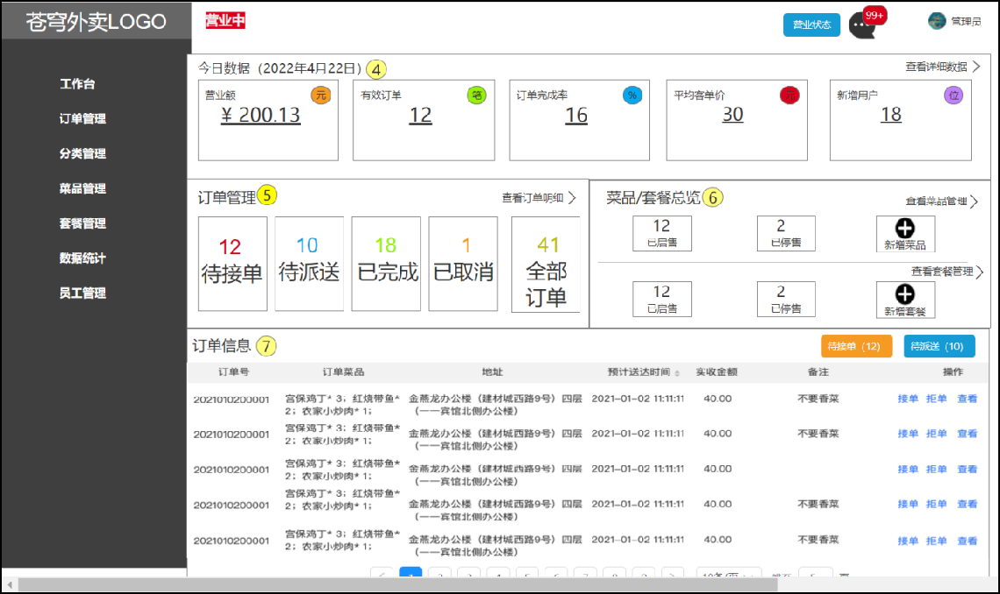

## 1. 工作台

### 1.1 需求分析和设计

#### 1.1.1 产品原型

工作台是系统运营的数据看板，并提供快捷操作入口，可以有效提高商家的工作效率。

**工作台展示的数据：**

- 今日数据
- 订单管理
- 菜品总览
- 套餐总览
- 订单信息


**原型图：**

 


**名词解释：**

- 营业额：已完成订单的总金额
- 有效订单：已完成订单的数量
- 订单完成率：有效订单数 / 总订单数 * 100%
- 平均客单价：营业额 / 有效订单数
- 新增用户：新增用户的数量


#### 1.1.2 接口设计

通过上述原型图分析，共包含6个接口。

**接口设计：**

- 今日数据接口
- 订单管理接口
- 菜品总览接口
- 套餐总览接口
- 订单搜索（已完成）
- 各个状态的订单数量统计（已完成）


**1). 今日数据的接口设计**

 

**2). 订单管理的接口设计**

 


**3). 菜品总览的接口设计**

 


**4). 套餐总览的接口设计**

 


### 1.2 代码导入

直接导入课程资料中的工作台模块功能代码即可：

 

#### 1.2.1 Controller层

**添加WorkSpaceController.java**

```java
package com.sky.controller.admin;

import com.sky.result.Result;
import com.sky.service.WorkspaceService;
import com.sky.vo.BusinessDataVO;
import com.sky.vo.DishOverViewVO;
import com.sky.vo.OrderOverViewVO;
import com.sky.vo.SetmealOverViewVO;
import io.swagger.annotations.Api;
import io.swagger.annotations.ApiOperation;
import lombok.extern.slf4j.Slf4j;
import org.springframework.beans.factory.annotation.Autowired;
import org.springframework.web.bind.annotation.GetMapping;
import org.springframework.web.bind.annotation.RequestMapping;
import org.springframework.web.bind.annotation.RestController;
import java.time.LocalDateTime;
import java.time.LocalTime;

/**
 * 工作台
 */
@RestController
@RequestMapping("/admin/workspace")
@Slf4j
@Api(tags = "工作台相关接口")
public class WorkSpaceController {

    @Autowired
    private WorkspaceService workspaceService;

    /**
     * 工作台今日数据查询
     * @return
     */
    @GetMapping("/businessData")
    @ApiOperation("工作台今日数据查询")
    public Result<BusinessDataVO> businessData(){
        //获得当天的开始时间
        LocalDateTime begin = LocalDateTime.now().with(LocalTime.MIN);
        //获得当天的结束时间
        LocalDateTime end = LocalDateTime.now().with(LocalTime.MAX);

        BusinessDataVO businessDataVO = workspaceService.getBusinessData(begin, end);
        return Result.success(businessDataVO);
    }

    /**
     * 查询订单管理数据
     * @return
     */
    @GetMapping("/overviewOrders")
    @ApiOperation("查询订单管理数据")
    public Result<OrderOverViewVO> orderOverView(){
        return Result.success(workspaceService.getOrderOverView());
    }

    /**
     * 查询菜品总览
     * @return
     */
    @GetMapping("/overviewDishes")
    @ApiOperation("查询菜品总览")
    public Result<DishOverViewVO> dishOverView(){
        return Result.success(workspaceService.getDishOverView());
    }

    /**
     * 查询套餐总览
     * @return
     */
    @GetMapping("/overviewSetmeals")
    @ApiOperation("查询套餐总览")
    public Result<SetmealOverViewVO> setmealOverView(){
        return Result.success(workspaceService.getSetmealOverView());
    }
}
```


#### 1.2.2 Service层接口

**添加WorkspaceService.java**

```java
package com.sky.service;

import com.sky.vo.BusinessDataVO;
import com.sky.vo.DishOverViewVO;
import com.sky.vo.OrderOverViewVO;
import com.sky.vo.SetmealOverViewVO;
import java.time.LocalDateTime;

public interface WorkspaceService {

    /**
     * 根据时间段统计营业数据
     * @param begin
     * @param end
     * @return
     */
    BusinessDataVO getBusinessData(LocalDateTime begin, LocalDateTime end);

    /**
     * 查询订单管理数据
     * @return
     */
    OrderOverViewVO getOrderOverView();

    /**
     * 查询菜品总览
     * @return
     */
    DishOverViewVO getDishOverView();

    /**
     * 查询套餐总览
     * @return
     */
    SetmealOverViewVO getSetmealOverView();

}
```


#### 1.2.3 Service层实现类

**添加WorkspaceServiceImpl.java**

```java
package com.sky.service.impl;

import com.sky.constant.StatusConstant;
import com.sky.entity.Orders;
import com.sky.mapper.DishMapper;
import com.sky.mapper.OrderMapper;
import com.sky.mapper.SetmealMapper;
import com.sky.mapper.UserMapper;
import com.sky.service.WorkspaceService;
import com.sky.vo.BusinessDataVO;
import com.sky.vo.DishOverViewVO;
import com.sky.vo.OrderOverViewVO;
import com.sky.vo.SetmealOverViewVO;
import lombok.extern.slf4j.Slf4j;
import org.springframework.beans.factory.annotation.Autowired;
import org.springframework.stereotype.Service;
import java.time.LocalDateTime;
import java.time.LocalTime;
import java.util.HashMap;
import java.util.Map;

@Service
@Slf4j
public class WorkspaceServiceImpl implements WorkspaceService {

    @Autowired
    private OrderMapper orderMapper;
    @Autowired
    private UserMapper userMapper;
    @Autowired
    private DishMapper dishMapper;
    @Autowired
    private SetmealMapper setmealMapper;

    /**
     * 根据时间段统计营业数据
     * @param begin
     * @param end
     * @return
     */
    public BusinessDataVO getBusinessData(LocalDateTime begin, LocalDateTime end) {
        /**
         * 营业额：当日已完成订单的总金额
         * 有效订单：当日已完成订单的数量
         * 订单完成率：有效订单数 / 总订单数
         * 平均客单价：营业额 / 有效订单数
         * 新增用户：当日新增用户的数量
         */

        Map map = new HashMap();
        map.put("begin",begin);
        map.put("end",end);

        //查询总订单数
        Integer totalOrderCount = orderMapper.countByMap(map);

        map.put("status", Orders.COMPLETED);
        //营业额
        Double turnover = orderMapper.sumByMap(map);
        turnover = turnover == null? 0.0 : turnover;

        //有效订单数
        Integer validOrderCount = orderMapper.countByMap(map);

        Double unitPrice = 0.0;

        Double orderCompletionRate = 0.0;
        if(totalOrderCount != 0 && validOrderCount != 0){
            //订单完成率
            orderCompletionRate = validOrderCount.doubleValue() / totalOrderCount;
            //平均客单价
            unitPrice = turnover / validOrderCount;
        }

        //新增用户数
        Integer newUsers = userMapper.countByMap(map);

        return BusinessDataVO.builder()
                .turnover(turnover)
                .validOrderCount(validOrderCount)
                .orderCompletionRate(orderCompletionRate)
                .unitPrice(unitPrice)
                .newUsers(newUsers)
                .build();
    }


    /**
     * 查询订单管理数据
     *
     * @return
     */
    public OrderOverViewVO getOrderOverView() {
        Map map = new HashMap();
        map.put("begin", LocalDateTime.now().with(LocalTime.MIN));
        map.put("status", Orders.TO_BE_CONFIRMED);

        //待接单
        Integer waitingOrders = orderMapper.countByMap(map);

        //待派送
        map.put("status", Orders.CONFIRMED);
        Integer deliveredOrders = orderMapper.countByMap(map);

        //已完成
        map.put("status", Orders.COMPLETED);
        Integer completedOrders = orderMapper.countByMap(map);

        //已取消
        map.put("status", Orders.CANCELLED);
        Integer cancelledOrders = orderMapper.countByMap(map);

        //全部订单
        map.put("status", null);
        Integer allOrders = orderMapper.countByMap(map);

        return OrderOverViewVO.builder()
                .waitingOrders(waitingOrders)
                .deliveredOrders(deliveredOrders)
                .completedOrders(completedOrders)
                .cancelledOrders(cancelledOrders)
                .allOrders(allOrders)
                .build();
    }

    /**
     * 查询菜品总览
     *
     * @return
     */
    public DishOverViewVO getDishOverView() {
        Map map = new HashMap();
        map.put("status", StatusConstant.ENABLE);
        Integer sold = dishMapper.countByMap(map);

        map.put("status", StatusConstant.DISABLE);
        Integer discontinued = dishMapper.countByMap(map);

        return DishOverViewVO.builder()
                .sold(sold)
                .discontinued(discontinued)
                .build();
    }

    /**
     * 查询套餐总览
     *
     * @return
     */
    public SetmealOverViewVO getSetmealOverView() {
        Map map = new HashMap();
        map.put("status", StatusConstant.ENABLE);
        Integer sold = setmealMapper.countByMap(map);

        map.put("status", StatusConstant.DISABLE);
        Integer discontinued = setmealMapper.countByMap(map);

        return SetmealOverViewVO.builder()
                .sold(sold)
                .discontinued(discontinued)
                .build();
    }
}
```


#### 1.2.4 Mapper层

**在SetmealMapper中添加countByMap方法定义**

```java
	/**
     * 根据条件统计套餐数量
     * @param map
     * @return
     */
    Integer countByMap(Map map);
```

**在SetmealMapper.xml中添加对应SQL实现**

```xml
<select id="countByMap" resultType="java.lang.Integer">
        select count(id) from setmeal
        <where>
            <if test="status != null">
                and status = #{status}
            </if>
            <if test="categoryId != null">
                and category_id = #{categoryId}
            </if>
        </where>
</select>
```


**在DishMapper中添加countByMap方法定义**

```java
	/**
     * 根据条件统计菜品数量
     * @param map
     * @return
     */
    Integer countByMap(Map map);
```

**在DishMapper.xml中添加对应SQL实现**

```xml
<select id="countByMap" resultType="java.lang.Integer">
        select count(id) from dish
        <where>
            <if test="status != null">
                and status = #{status}
            </if>
            <if test="categoryId != null">
                and category_id = #{categoryId}
            </if>
        </where>
</select>
```


### 1.3 功能测试

可以通过如下方式进行测试：

- 通过接口文档测试
- 前后端联调测试

接下来我们使用上述两种方式分别测试。

#### 1.3.1 接口文档测试

**启动服务**，访问http://localhost:8080/doc.html，进入工作台相关接口

**注意：**使用admin用户登录重新获取token，在全局参数设置中添加，防止token失效。

**1). 今日数据查询**

 


**2). 菜品总览查询**

 


**3). 订单管理数据查询**

 


**4). 套餐总览查询**

 


#### 1.3.2 前后端联调测试

**启动nginx**,访问 http://localhost，进入工作台

 

进入开发者模式，分别查看今日数据、订单管理、菜品总览、套餐总览

**1). 今日数据查询**

 


**2). 订单管理数据查询**

 


**3). 菜品总览查询**

 


**4). 套餐总览查询**

 


