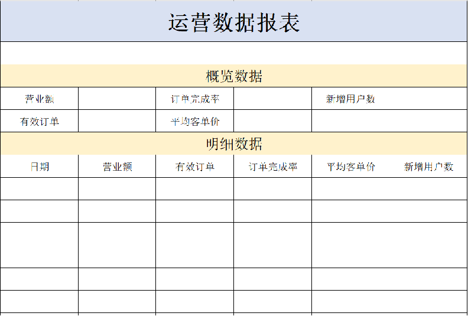

## 1. 导出运营数据Excel报表

### 1.1 需求分析和设计

#### 1.1.1 产品原型

在数据统计页面，有一个数据导出的按钮，点击该按钮时，其实就会下载一个文件。这个文件实际上是一个Excel形式的文件，文件中主要包含最近30日运营相关的数据。表格的形式已经固定，主要由概览数据和明细数据两部分组成。真正导出这个报表之后，相对应的数字就会填充在表格中，就可以进行存档。

**原型图：**

 

导出的Excel报表格式：

  


**业务规则：**

- 导出Excel形式的报表文件
- 导出最近30天的运营数据


#### 1.1.2 接口设计

通过上述原型图设计对应的接口。

 

**注意：**

- 当前接口没有传递参数，因为导出的是最近30天的运营数据，后端计算即可，所以不需要任何参数

- 当前接口没有返回数据，因为报表导出功能本质上是文件下载，服务端会通过输出流将Excel文件下载到客户端浏览器


### 1.2 代码开发

#### 1.2.1 实现步骤

1). 设计Excel模板文件

2). 查询近30天的运营数据

3). 将查询到的运营数据写入模板文件

4). 通过输出流将Excel文件下载到客户端浏览器

 

#### 1.2.2 Controller层

**根据接口定义，在ReportController中创建export方法：**

```java
	/**
     * 导出运营数据报表
     * @param response
     */
    @GetMapping("/export")
    @ApiOperation("导出运营数据报表")
    public void export(HttpServletResponse response){
        reportService.exportBusinessData(response);
    }
```


#### 1.2.3 Service层接口

**在ReportService接口中声明导出运营数据报表的方法：**

```java
	/**
     * 导出近30天的运营数据报表
     * @param response
     **/
    void exportBusinessData(HttpServletResponse response);
```


#### 1.2.4 Service层实现类

**在ReportServiceImpl实现类中实现导出运营数据报表的方法:**

提前将资料中的**运营数据报表模板.xlsx**拷贝到项目的resources/template目录中

```java
    /**导出近30天的运营数据报表
     * @param response
     **/
    public void exportBusinessData(HttpServletResponse response) {
        LocalDate begin = LocalDate.now().minusDays(30);
        LocalDate end = LocalDate.now().minusDays(1);
        //查询概览运营数据，提供给Excel模板文件
        BusinessDataVO businessData = workspaceService.getBusinessData(LocalDateTime.of(begin,LocalTime.MIN), LocalDateTime.of(end, LocalTime.MAX));
        InputStream inputStream = this.getClass().getClassLoader().getResourceAsStream("template/运营数据报表模板.xlsx");
        try {
            //基于提供好的模板文件创建一个新的Excel表格对象
            XSSFWorkbook excel = new XSSFWorkbook(inputStream);
            //获得Excel文件中的一个Sheet页
            XSSFSheet sheet = excel.getSheet("Sheet1");

            sheet.getRow(1).getCell(1).setCellValue(begin + "至" + end);
            //获得第4行
            XSSFRow row = sheet.getRow(3);
            //获取单元格
            row.getCell(2).setCellValue(businessData.getTurnover());
            row.getCell(4).setCellValue(businessData.getOrderCompletionRate());
            row.getCell(6).setCellValue(businessData.getNewUsers());
            row = sheet.getRow(4);
            row.getCell(2).setCellValue(businessData.getValidOrderCount());
            row.getCell(4).setCellValue(businessData.getUnitPrice());
            for (int i = 0; i < 30; i++) {
                LocalDate date = begin.plusDays(i);
               //准备明细数据
                businessData = workspaceService.getBusinessData(LocalDateTime.of(date,LocalTime.MIN), LocalDateTime.of(date, LocalTime.MAX));
                row = sheet.getRow(7 + i);
                row.getCell(1).setCellValue(date.toString());
                row.getCell(2).setCellValue(businessData.getTurnover());
                row.getCell(3).setCellValue(businessData.getValidOrderCount());
                row.getCell(4).setCellValue(businessData.getOrderCompletionRate());
                row.getCell(5).setCellValue(businessData.getUnitPrice());
                row.getCell(6).setCellValue(businessData.getNewUsers());
            }
            //通过输出流将文件下载到客户端浏览器中
            ServletOutputStream out = response.getOutputStream();
            excel.write(out);
            //关闭资源
            out.flush();
            out.close();
            excel.close();

        }catch (IOException e){
            e.printStackTrace();
        }
    }
```


### 1.3 功能测试

直接使用前后端联调测试。

**进入数据统计**

 

**点击数据导出**：Excel报表下载成功

 