## 1. 商品浏览功能代码

### 1.1 需求分析和设计

#### 1.1.1 产品原型

用户登录成功后跳转到系统首页，在首页需要根据分类来展示菜品和套餐。如果菜品设置了口味信息，需要展示按钮，否则显示按钮。

​         **菜品列表效果图**                                                   **菜品口味效果图**

                                

​         **套餐列表效果图**                                                   **套餐详情效果图**

                                


#### 1.1.2 接口设计

根据上述原型图先**粗粒度**设计接口，共包含4个接口。

**接口设计：**

- 查询分类
- 根据分类id查询菜品
- 根据分类id查询套餐
- 根据套餐id查询包含的菜品


接下来**细粒度**分析每个接口，明确每个接口的请求方式、请求路径、传入参数和返回值。

**1). 查询分类**

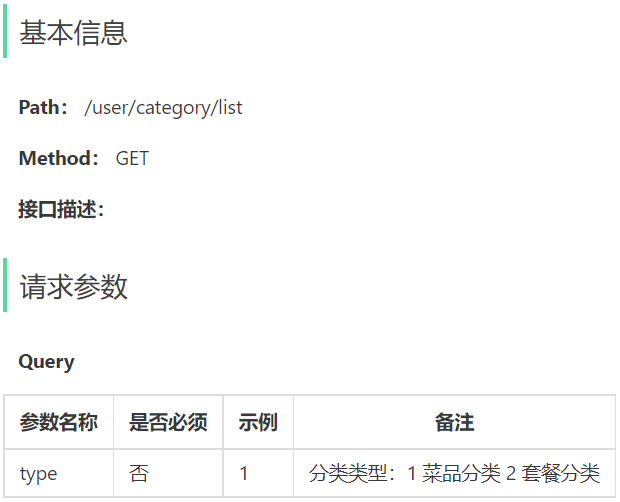 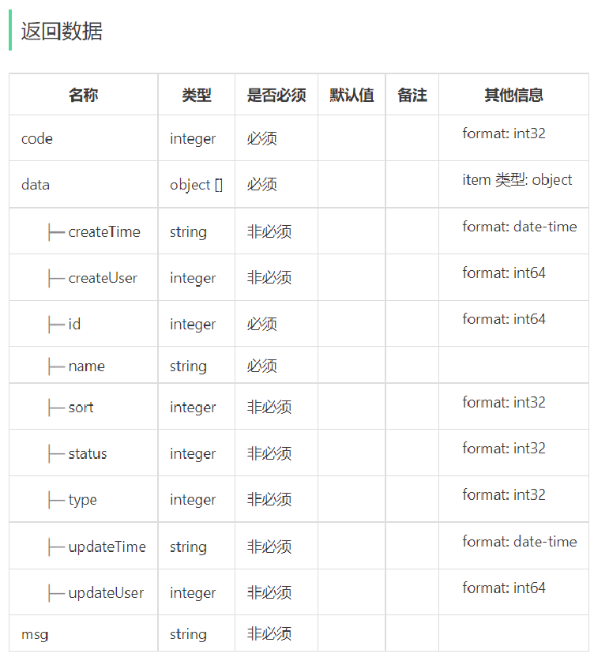


**2). 根据分类id查询菜品**

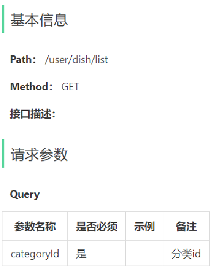 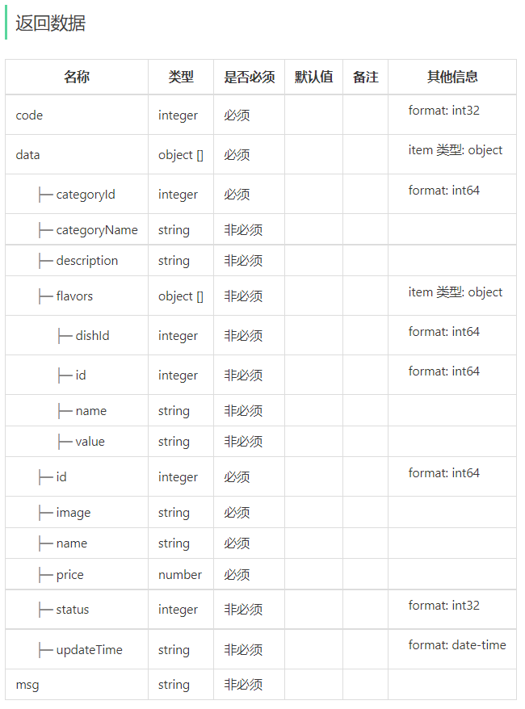


**3). 根据分类id查询套餐**

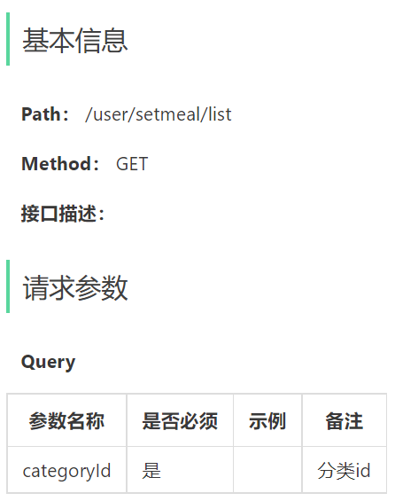 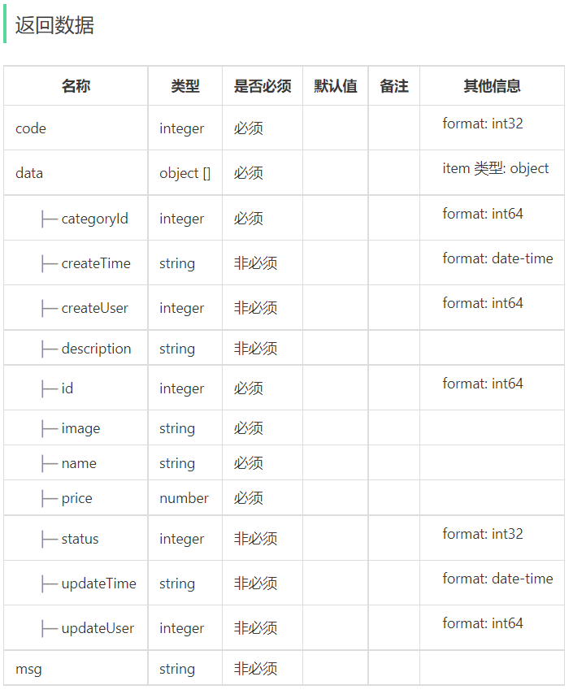


**4). 根据套餐id查询包含的菜品**

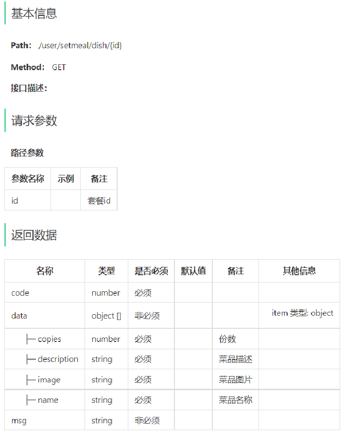 


### 1.2 代码导入

导入资料中的商品浏览功能代码即可

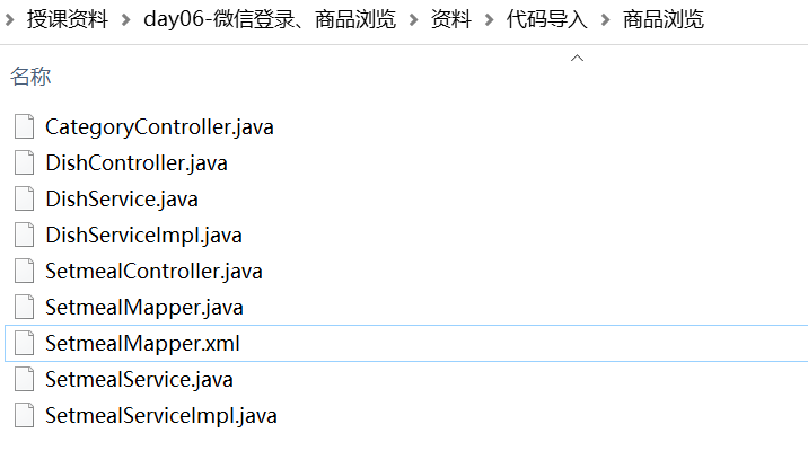 

可按照mapper-->service-->controller依次导入，这样代码不会显示相应的报错。

进入到sky-server模块中

#### 1.2.1 Mapper层

**在SetmealMapper.java中添加list和getDishItemBySetmealId两个方法**

```java
	/**
     * 动态条件查询套餐
     * @param setmeal
     * @return
     */
    List<Setmeal> list(Setmeal setmeal);

    /**
     * 根据套餐id查询菜品选项
     * @param setmealId
     * @return
     */
    @Select("select sd.name, sd.copies, d.image, d.description " +
            "from setmeal_dish sd left join dish d on sd.dish_id = d.id " +
            "where sd.setmeal_id = #{setmealId}")
    List<DishItemVO> getDishItemBySetmealId(Long setmealId);
```

**创建SetmealMapper.xml文件**

```xml
<?xml version="1.0" encoding="UTF-8" ?>
<!DOCTYPE mapper PUBLIC "-//mybatis.org//DTD Mapper 3.0//EN"
        "http://mybatis.org/dtd/mybatis-3-mapper.dtd" >
<mapper namespace="com.sky.mapper.SetmealMapper">

    <select id="list" parameterType="Setmeal" resultType="Setmeal">
        select * from setmeal
        <where>
            <if test="name != null">
                and name like concat('%',#{name},'%')
            </if>
            <if test="categoryId != null">
                and category_id = #{categoryId}
            </if>
            <if test="status != null">
                and status = #{status}
            </if>
        </where>
    </select>
</mapper>
```


#### 1.2.2 Service层

**创建SetmealService.java**

```java
package com.sky.service;

import com.sky.dto.SetmealDTO;
import com.sky.dto.SetmealPageQueryDTO;
import com.sky.entity.Setmeal;
import com.sky.result.PageResult;
import com.sky.vo.DishItemVO;
import com.sky.vo.SetmealVO;
import java.util.List;

public interface SetmealService {

    /**
     * 条件查询
     * @param setmeal
     * @return
     */
    List<Setmeal> list(Setmeal setmeal);

    /**
     * 根据id查询菜品选项
     * @param id
     * @return
     */
    List<DishItemVO> getDishItemById(Long id);

}
```

**创建SetmealServiceImpl.java**

```java
package com.sky.service.impl;

import com.sky.entity.Setmeal;
import com.sky.mapper.DishMapper;
import com.sky.mapper.SetmealDishMapper;
import com.sky.mapper.SetmealMapper;
import com.sky.service.SetmealService;
import com.sky.vo.DishItemVO;
import lombok.extern.slf4j.Slf4j;
import org.springframework.beans.factory.annotation.Autowired;
import org.springframework.stereotype.Service;

import java.util.List;

/**
 * 套餐业务实现
 */
@Service
@Slf4j
public class SetmealServiceImpl implements SetmealService {

    @Autowired
    private SetmealMapper setmealMapper;
    @Autowired
    private SetmealDishMapper setmealDishMapper;
    @Autowired
    private DishMapper dishMapper;

    /**
     * 条件查询
     * @param setmeal
     * @return
     */
    public List<Setmeal> list(Setmeal setmeal) {
        List<Setmeal> list = setmealMapper.list(setmeal);
        return list;
    }

    /**
     * 根据id查询菜品选项
     * @param id
     * @return
     */
    public List<DishItemVO> getDishItemById(Long id) {
        return setmealMapper.getDishItemBySetmealId(id);
    }
}
```

**在DishService.java中添加listWithFlavor方法定义**

```java
	/**
     * 条件查询菜品和口味
     * @param dish
     * @return
     */
    List<DishVO> listWithFlavor(Dish dish);
```

**在DishServiceImpl.java中实现listWithFlavor方法**

```java
	/**
     * 条件查询菜品和口味
     * @param dish
     * @return
     */
    public List<DishVO> listWithFlavor(Dish dish) {
        List<Dish> dishList = dishMapper.list(dish);

        List<DishVO> dishVOList = new ArrayList<>();

        for (Dish d : dishList) {
            DishVO dishVO = new DishVO();
            BeanUtils.copyProperties(d,dishVO);

            //根据菜品id查询对应的口味
            List<DishFlavor> flavors = dishFlavorMapper.getByDishId(d.getId());

            dishVO.setFlavors(flavors);
            dishVOList.add(dishVO);
        }

        return dishVOList;
    }
```


#### 1.2.3 Controller层

**创建DishController.java**

```java
package com.sky.controller.user;

import com.sky.constant.StatusConstant;
import com.sky.entity.Dish;
import com.sky.result.Result;
import com.sky.service.DishService;
import com.sky.vo.DishVO;
import io.swagger.annotations.Api;
import io.swagger.annotations.ApiOperation;
import lombok.extern.slf4j.Slf4j;
import org.springframework.beans.factory.annotation.Autowired;
import org.springframework.web.bind.annotation.GetMapping;
import org.springframework.web.bind.annotation.RequestMapping;
import org.springframework.web.bind.annotation.RestController;
import java.util.List;

@RestController("userDishController")
@RequestMapping("/user/dish")
@Slf4j
@Api(tags = "C端-菜品浏览接口")
public class DishController {
    @Autowired
    private DishService dishService;

    /**
     * 根据分类id查询菜品
     *
     * @param categoryId
     * @return
     */
    @GetMapping("/list")
    @ApiOperation("根据分类id查询菜品")
    public Result<List<DishVO>> list(Long categoryId) {
        Dish dish = new Dish();
        dish.setCategoryId(categoryId);
        dish.setStatus(StatusConstant.ENABLE);//查询起售中的菜品

        List<DishVO> list = dishService.listWithFlavor(dish);

        return Result.success(list);
    }

}
```

**创建CategoryController.java**

```java
package com.sky.controller.user;

import com.sky.entity.Category;
import com.sky.result.Result;
import com.sky.service.CategoryService;
import io.swagger.annotations.Api;
import io.swagger.annotations.ApiOperation;
import org.springframework.beans.factory.annotation.Autowired;
import org.springframework.web.bind.annotation.GetMapping;
import org.springframework.web.bind.annotation.RequestMapping;
import org.springframework.web.bind.annotation.RestController;
import java.util.List;

@RestController("userCategoryController")
@RequestMapping("/user/category")
@Api(tags = "C端-分类接口")
public class CategoryController {

    @Autowired
    private CategoryService categoryService;

    /**
     * 查询分类
     * @param type
     * @return
     */
    @GetMapping("/list")
    @ApiOperation("查询分类")
    public Result<List<Category>> list(Integer type) {
        List<Category> list = categoryService.list(type);
        return Result.success(list);
    }
}
```

**创建SetmealController.java**

```java
package com.sky.controller.user;

import com.sky.constant.StatusConstant;
import com.sky.entity.Setmeal;
import com.sky.result.Result;
import com.sky.service.SetmealService;
import com.sky.vo.DishItemVO;
import io.swagger.annotations.Api;
import io.swagger.annotations.ApiOperation;
import org.springframework.beans.factory.annotation.Autowired;
import org.springframework.web.bind.annotation.GetMapping;
import org.springframework.web.bind.annotation.PathVariable;
import org.springframework.web.bind.annotation.RequestMapping;
import org.springframework.web.bind.annotation.RestController;
import java.util.List;

@RestController("userSetmealController")
@RequestMapping("/user/setmeal")
@Api(tags = "C端-套餐浏览接口")
public class SetmealController {
    @Autowired
    private SetmealService setmealService;

    /**
     * 条件查询
     *
     * @param categoryId
     * @return
     */
    @GetMapping("/list")
    @ApiOperation("根据分类id查询套餐")
    public Result<List<Setmeal>> list(Long categoryId) {
        Setmeal setmeal = new Setmeal();
        setmeal.setCategoryId(categoryId);
        setmeal.setStatus(StatusConstant.ENABLE);

        List<Setmeal> list = setmealService.list(setmeal);
        return Result.success(list);
    }

    /**
     * 根据套餐id查询包含的菜品列表
     *
     * @param id
     * @return
     */
    @GetMapping("/dish/{id}")
    @ApiOperation("根据套餐id查询包含的菜品列表")
    public Result<List<DishItemVO>> dishList(@PathVariable("id") Long id) {
        List<DishItemVO> list = setmealService.getDishItemById(id);
        return Result.success(list);
    }
}
```


### 1.3 功能测试

重启服务器、重新编译小程序

微信登录进入首页

**菜品和套餐分类查询：**

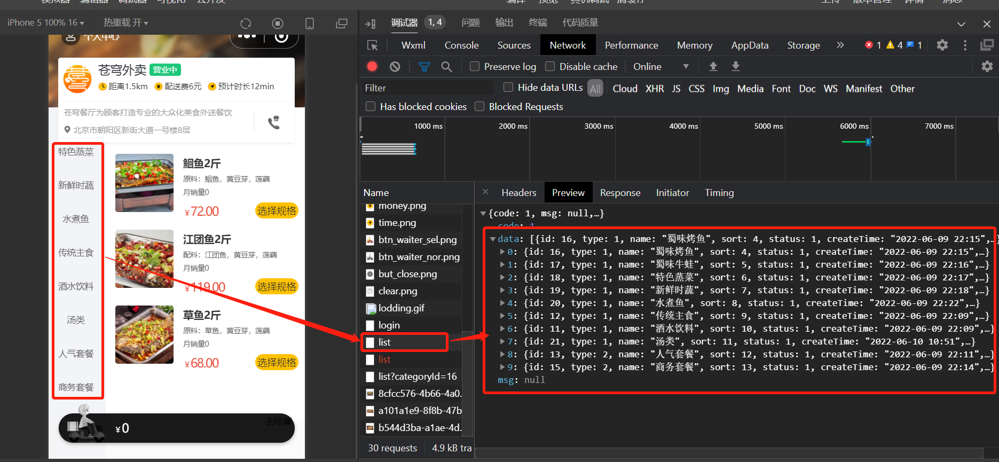 

**具体分类下的菜品查询：**

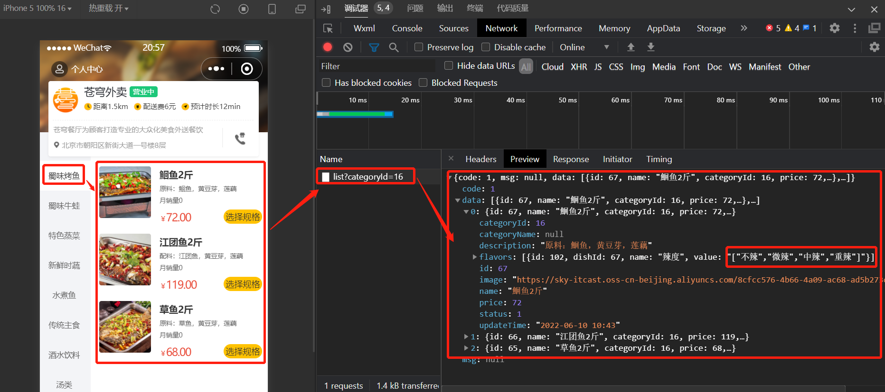 

**菜品口味查询：**

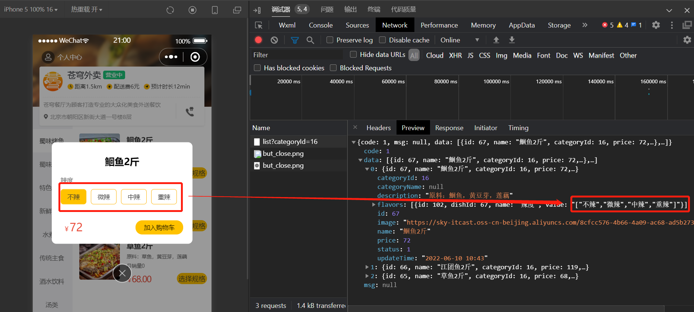 
