## 1. 地址簿功能代码

### 1.1 需求分析和设计

#### 1.1.1 产品原型

地址簿，指的是消费者用户的地址信息，用户登录成功后可以维护自己的地址信息。同一个用户可以有多个地址信息，但是只能有一个**默认地址**。

**效果图：**

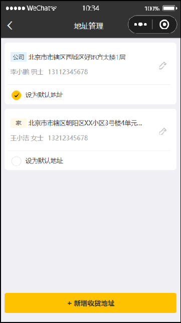              

对于地址簿管理，我们需要实现以下几个功能： 

- 查询地址列表
- 新增地址
- 修改地址
- 删除地址
- 设置默认地址
- 查询默认地址


#### 1.1.2 接口设计

根据上述原型图先**粗粒度**设计接口，共包含7个接口。

**接口设计：**

- 新增地址
- 查询登录用户所有地址
- 查询默认地址
- 根据id修改地址
- 根据id删除地址
- 根据id查询地址
- 设置默认地址

接下来**细粒度**分析每个接口，明确每个接口的请求方式、请求路径、传入参数和返回值。


**1). 新增地址**

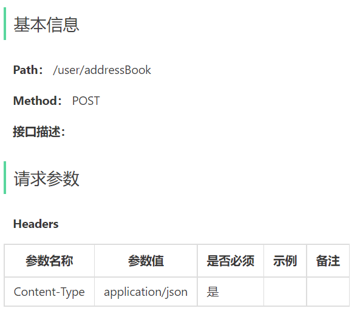 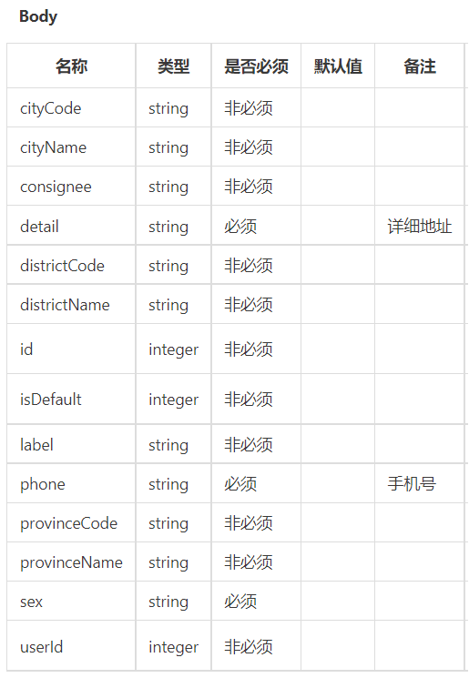 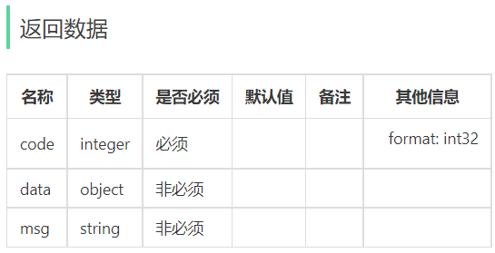 


**2). 查询登录用户所有地址**

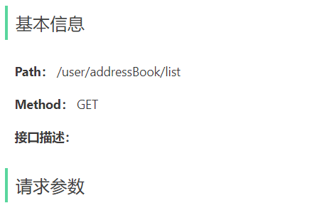 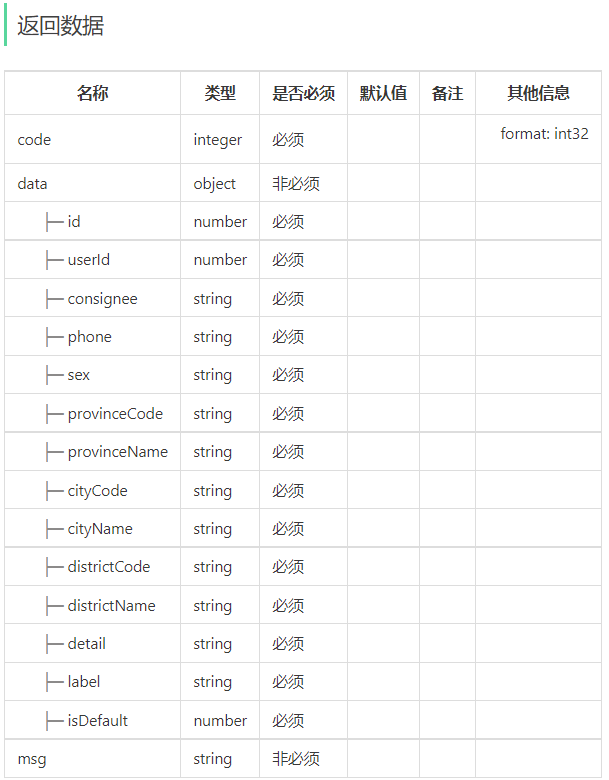 


**3). 查询默认地址**

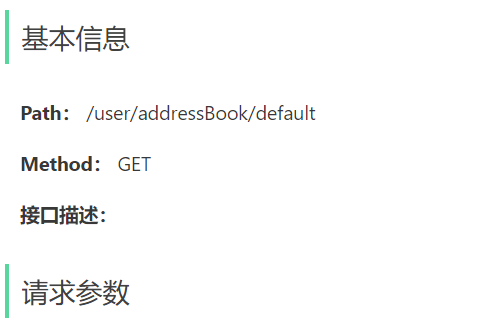 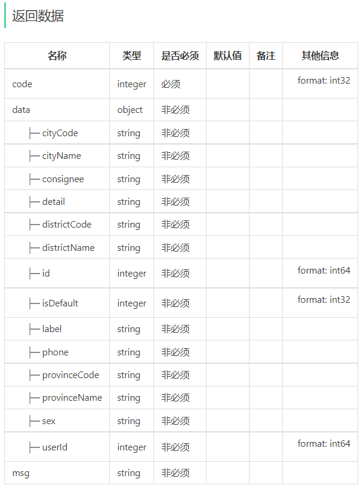 


**4). 修改地址**

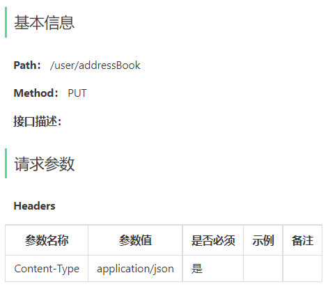 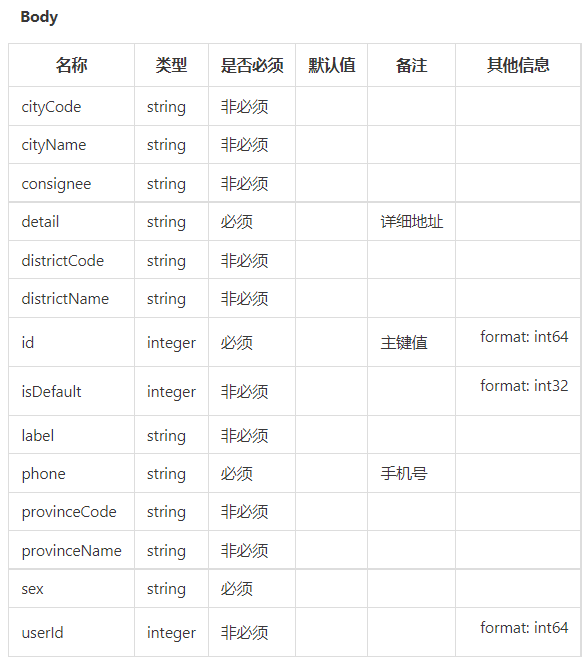 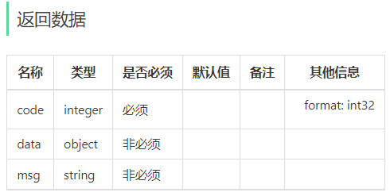 


**5). 根据id删除地址**

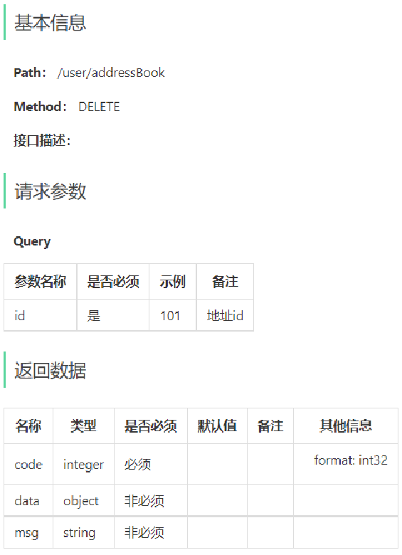 


**6). 根据id查询地址**

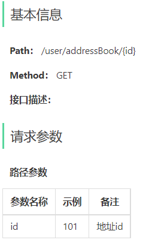 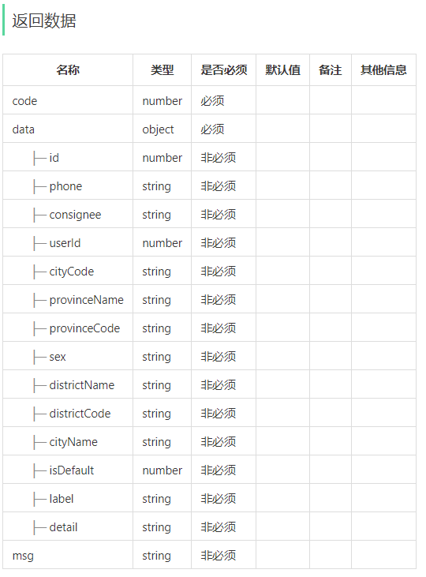 


**7). 设置默认地址**

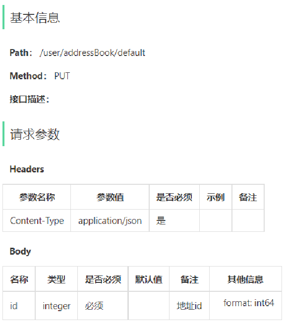 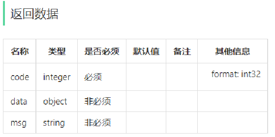 


#### 1.1.3 表设计

用户的地址信息会存储在address_book表，即地址簿表中。具体表结构如下：

| **字段名**    | **数据类型** | **说明**     | **备注**       |
| ------------- | ------------ | ------------ | -------------- |
| id            | bigint       | 主键         | 自增           |
| user_id       | bigint       | 用户id       | 逻辑外键       |
| consignee     | varchar(50)  | 收货人       |                |
| sex           | varchar(2)   | 性别         |                |
| phone         | varchar(11)  | 手机号       |                |
| province_code | varchar(12)  | 省份编码     |                |
| province_name | varchar(32)  | 省份名称     |                |
| city_code     | varchar(12)  | 城市编码     |                |
| city_name     | varchar(32)  | 城市名称     |                |
| district_code | varchar(12)  | 区县编码     |                |
| district_name | varchar(32)  | 区县名称     |                |
| detail        | varchar(200) | 详细地址信息 | 具体到门牌号   |
| label         | varchar(100) | 标签         | 公司、家、学校 |
| is_default    | tinyint(1)   | 是否默认地址 | 1是 0否        |

这里面有一个字段is_default，实际上我们在设置默认地址时，只需要更新这个字段就可以了。


### 1.2 代码导入

对于这一类的单表的增删改查，我们已经写过很多了，基本的开发思路都是一样的，那么本小节的用户地址簿管理的增删改查功能，我们就不再一一实现了，基本的代码我们都已经提供了，直接导入进来，做一个测试即可。

导入课程资料中的地址簿模块功能代码：

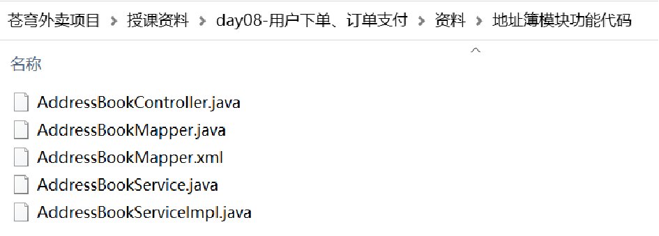 

进入到sky-server模块中

#### 1.2.1 Mapper层

**创建AddressBookMapper.java**

```java
package com.sky.mapper;

import com.sky.entity.AddressBook;
import org.apache.ibatis.annotations.*;
import java.util.List;

@Mapper
public interface AddressBookMapper {

    /**
     * 条件查询
     * @param addressBook
     * @return
     */
    List<AddressBook> list(AddressBook addressBook);

    /**
     * 新增
     * @param addressBook
     */
    @Insert("insert into address_book" +
            "        (user_id, consignee, phone, sex, province_code, province_name, city_code, city_name, district_code," +
            "         district_name, detail, label, is_default)" +
            "        values (#{userId}, #{consignee}, #{phone}, #{sex}, #{provinceCode}, #{provinceName}, #{cityCode}, #{cityName}," +
            "                #{districtCode}, #{districtName}, #{detail}, #{label}, #{isDefault})")
    void insert(AddressBook addressBook);

    /**
     * 根据id查询
     * @param id
     * @return
     */
    @Select("select * from address_book where id = #{id}")
    AddressBook getById(Long id);

    /**
     * 根据id修改
     * @param addressBook
     */
    void update(AddressBook addressBook);

    /**
     * 根据 用户id修改 是否默认地址
     * @param addressBook
     */
    @Update("update address_book set is_default = #{isDefault} where user_id = #{userId}")
    void updateIsDefaultByUserId(AddressBook addressBook);

    /**
     * 根据id删除地址
     * @param id
     */
    @Delete("delete from address_book where id = #{id}")
    void deleteById(Long id);

}
```

**创建AddressBookMapper.xml**

```xml
<?xml version="1.0" encoding="UTF-8" ?>
<!DOCTYPE mapper PUBLIC "-//mybatis.org//DTD Mapper 3.0//EN" "http://mybatis.org/dtd/mybatis-3-mapper.dtd" >
<mapper namespace="com.sky.mapper.AddressBookMapper">

    <select id="list" parameterType="AddressBook" resultType="AddressBook">
        select * from address_book
        <where>
            <if test="userId != null">
                and user_id = #{userId}
            </if>
            <if test="phone != null">
                and phone = #{phone}
            </if>
            <if test="isDefault != null">
                and is_default = #{isDefault}
            </if>
        </where>
    </select>

    <update id="update" parameterType="addressBook">
        update address_book
        <set>
            <if test="consignee != null">
                consignee = #{consignee},
            </if>
            <if test="sex != null">
                sex = #{sex},
            </if>
            <if test="phone != null">
                phone = #{phone},
            </if>
            <if test="detail != null">
                detail = #{detail},
            </if>
            <if test="label != null">
                label = #{label},
            </if>
            <if test="isDefault != null">
                is_default = #{isDefault},
            </if>
        </set>
        where id = #{id}
    </update>

</mapper>
```


#### 1.2.2 Service层

**创建AddressBookService.java**

```java
package com.sky.service;

import com.sky.entity.AddressBook;
import java.util.List;

public interface AddressBookService {

    List<AddressBook> list(AddressBook addressBook);

    void save(AddressBook addressBook);

    AddressBook getById(Long id);

    void update(AddressBook addressBook);

    void setDefault(AddressBook addressBook);

    void deleteById(Long id);

}
```

**创建AddressBookServiceImpl.java**

```java
package com.sky.service.impl;

import com.sky.context.BaseContext;
import com.sky.entity.AddressBook;
import com.sky.mapper.AddressBookMapper;
import com.sky.service.AddressBookService;
import lombok.extern.slf4j.Slf4j;
import org.springframework.beans.factory.annotation.Autowired;
import org.springframework.stereotype.Service;
import org.springframework.transaction.annotation.Transactional;
import java.util.List;

@Service
@Slf4j
public class AddressBookServiceImpl implements AddressBookService {
    @Autowired
    private AddressBookMapper addressBookMapper;

    /**
     * 条件查询
     *
     * @param addressBook
     * @return
     */
    public List<AddressBook> list(AddressBook addressBook) {
        return addressBookMapper.list(addressBook);
    }

    /**
     * 新增地址
     *
     * @param addressBook
     */
    public void save(AddressBook addressBook) {
        addressBook.setUserId(BaseContext.getCurrentId());
        addressBook.setIsDefault(0);
        addressBookMapper.insert(addressBook);
    }

    /**
     * 根据id查询
     *
     * @param id
     * @return
     */
    public AddressBook getById(Long id) {
        AddressBook addressBook = addressBookMapper.getById(id);
        return addressBook;
    }

    /**
     * 根据id修改地址
     *
     * @param addressBook
     */
    public void update(AddressBook addressBook) {
        addressBookMapper.update(addressBook);
    }

    /**
     * 设置默认地址
     *
     * @param addressBook
     */
    @Transactional
    public void setDefault(AddressBook addressBook) {
        //1、将当前用户的所有地址修改为非默认地址 update address_book set is_default = ? where user_id = ?
        addressBook.setIsDefault(0);
        addressBook.setUserId(BaseContext.getCurrentId());
        addressBookMapper.updateIsDefaultByUserId(addressBook);

        //2、将当前地址改为默认地址 update address_book set is_default = ? where id = ?
        addressBook.setIsDefault(1);
        addressBookMapper.update(addressBook);
    }

    /**
     * 根据id删除地址
     *
     * @param id
     */
    public void deleteById(Long id) {
        addressBookMapper.deleteById(id);
    }

}
```


#### 1.2.3 Controller层

```java
package com.sky.controller.user;

import com.sky.context.BaseContext;
import com.sky.entity.AddressBook;
import com.sky.result.Result;
import com.sky.service.AddressBookService;
import io.swagger.annotations.Api;
import io.swagger.annotations.ApiOperation;
import org.springframework.beans.factory.annotation.Autowired;
import org.springframework.web.bind.annotation.*;
import java.util.List;

@RestController
@RequestMapping("/user/addressBook")
@Api(tags = "C端地址簿接口")
public class AddressBookController {

    @Autowired
    private AddressBookService addressBookService;

    /**
     * 查询当前登录用户的所有地址信息
     *
     * @return
     */
    @GetMapping("/list")
    @ApiOperation("查询当前登录用户的所有地址信息")
    public Result<List<AddressBook>> list() {
        AddressBook addressBook = new AddressBook();
        addressBook.setUserId(BaseContext.getCurrentId());
        List<AddressBook> list = addressBookService.list(addressBook);
        return Result.success(list);
    }

    /**
     * 新增地址
     *
     * @param addressBook
     * @return
     */
    @PostMapping
    @ApiOperation("新增地址")
    public Result save(@RequestBody AddressBook addressBook) {
        addressBookService.save(addressBook);
        return Result.success();
    }

    @GetMapping("/{id}")
    @ApiOperation("根据id查询地址")
    public Result<AddressBook> getById(@PathVariable Long id) {
        AddressBook addressBook = addressBookService.getById(id);
        return Result.success(addressBook);
    }

    /**
     * 根据id修改地址
     *
     * @param addressBook
     * @return
     */
    @PutMapping
    @ApiOperation("根据id修改地址")
    public Result update(@RequestBody AddressBook addressBook) {
        addressBookService.update(addressBook);
        return Result.success();
    }

    /**
     * 设置默认地址
     *
     * @param addressBook
     * @return
     */
    @PutMapping("/default")
    @ApiOperation("设置默认地址")
    public Result setDefault(@RequestBody AddressBook addressBook) {
        addressBookService.setDefault(addressBook);
        return Result.success();
    }

    /**
     * 根据id删除地址
     *
     * @param id
     * @return
     */
    @DeleteMapping
    @ApiOperation("根据id删除地址")
    public Result deleteById(Long id) {
        addressBookService.deleteById(id);
        return Result.success();
    }

    /**
     * 查询默认地址
     */
    @GetMapping("default")
    @ApiOperation("查询默认地址")
    public Result<AddressBook> getDefault() {
        //SQL:select * from address_book where user_id = ? and is_default = 1
        AddressBook addressBook = new AddressBook();
        addressBook.setIsDefault(1);
        addressBook.setUserId(BaseContext.getCurrentId());
        List<AddressBook> list = addressBookService.list(addressBook);

        if (list != null && list.size() == 1) {
            return Result.success(list.get(0));
        }

        return Result.error("没有查询到默认地址");
    }

}
```


### 1.3 功能测试

可以通过如下方式进行测试：

- 查看控制台sql和数据库中的数据变化
- Swagger接口文档测试
- 前后端联调

我们直接使用**前后端联调**测试：

启动后台服务，编译小程序

登录进入首页-->进入个人中心-->进入地址管理

 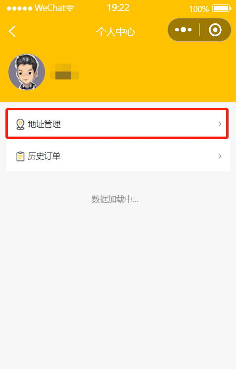 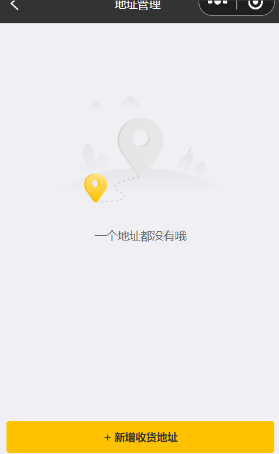 


**1). 新增收货地址**

**添加两条收货地址：**

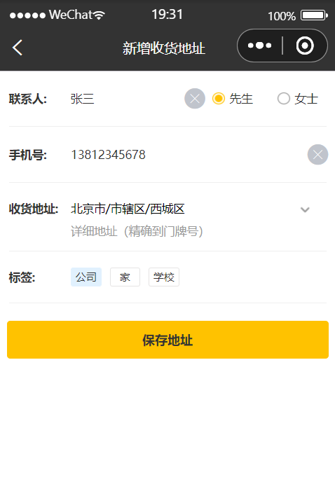 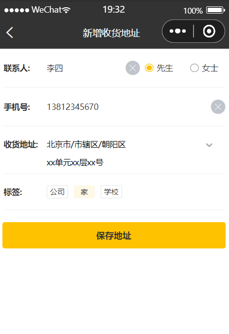 


**查看收货地址：**

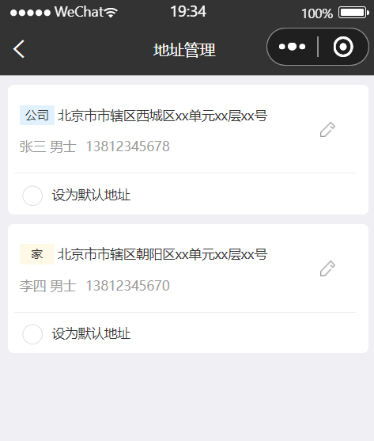 


**查看数据库：**

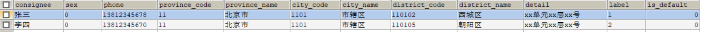 


**2). 设置默认收货地址**

**设置默认地址：**

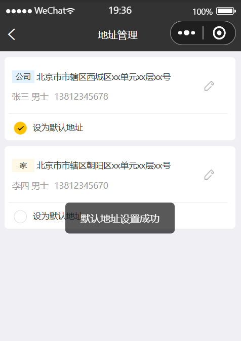 

**查看数据库：**

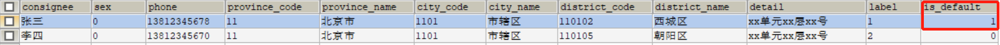 


**3). 删除收货地址**

**进行编辑：**

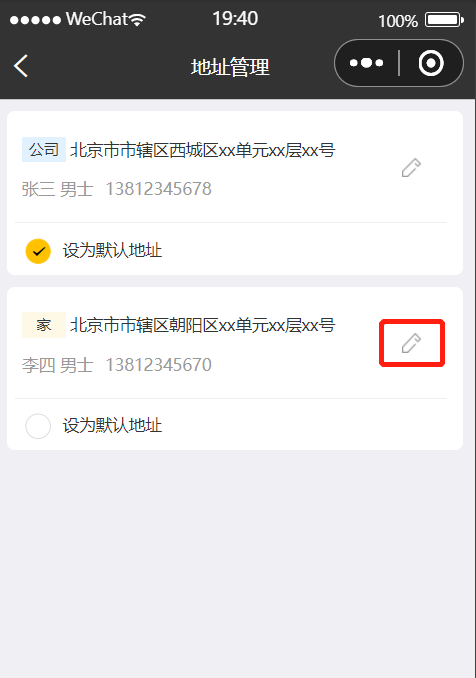 

**删除地址：**

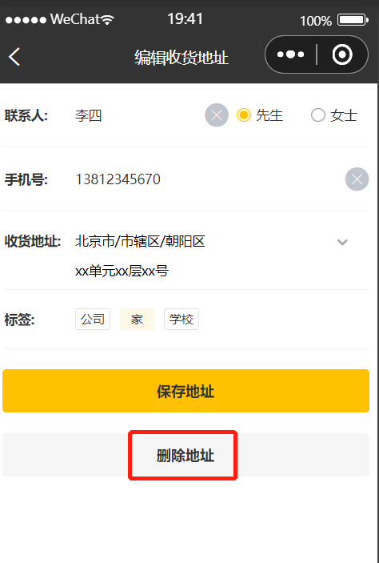 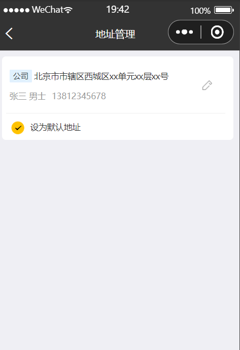

**查看数据库：**

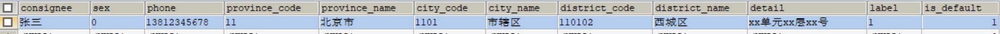 


