功能实现：**营业状态设置**

**效果图：**

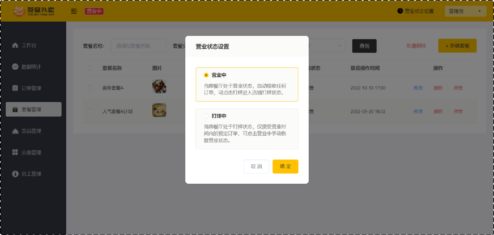 

选择**营业中**，客户可在小程序端下单：

 

选择**打烊中**，客户无法在小程序端下单：

 


## 1. 店铺营业状态设置

### 1.1 需求分析和设计

#### 1.1.1 产品原型

进到苍穹外卖后台，显示餐厅的营业状态，营业状态分为**营业中**和**打烊中**，若当前餐厅处于营业状态，自动接收任何订单，客户可在小程序进行下单操作；若当前餐厅处于打烊状态，不接受任何订单，客户便无法在小程序进行下单操作。

 

点击**营业状态**按钮时，弹出更改营业状态

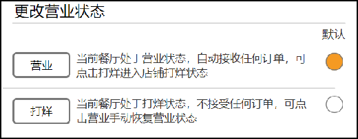 

选择营业，设置餐厅为**营业中**状态

选择打烊，设置餐厅为**打烊中**状态

**状态说明：**

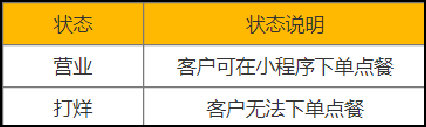 


#### 1.1.2 接口设计

根据上述原型图设计接口，共包含3个接口。

**接口设计：**

- 设置营业状态
- 管理端查询营业状态
- 用户端查询营业状态

**注：**从技术层面分析，其实管理端和用户端查询营业状态时，可通过一个接口去实现即可。因为营业状态是一致的。但是，本项目约定：

- **管理端**发出的请求，统一使用/admin作为前缀。
- **用户端**发出的请求，统一使用/user作为前缀。

因为访问路径不一致，故分为两个接口实现。

**1). 设置营业状态**

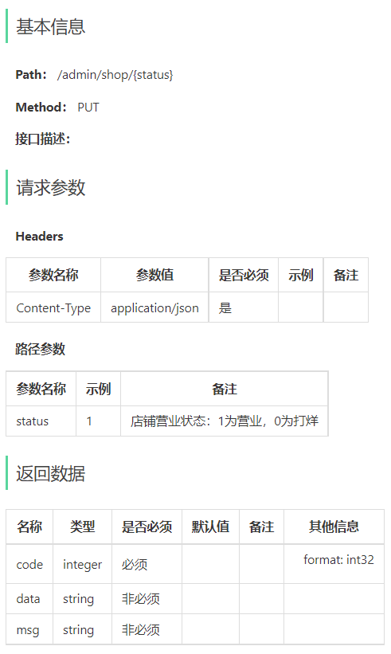 


**2). 管理端营业状态**

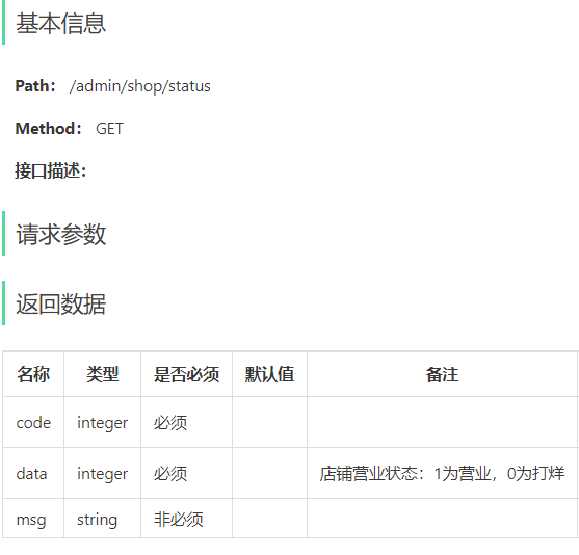 


**3). 用户端营业状态**

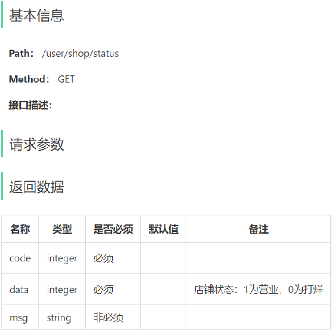 


#### 1.1.3 营业状态存储方式

虽然，可以通过一张表来存储营业状态数据，但整个表中只有一个字段，所以意义不大。

营业状态数据存储方式：基于Redis的字符串来进行存储

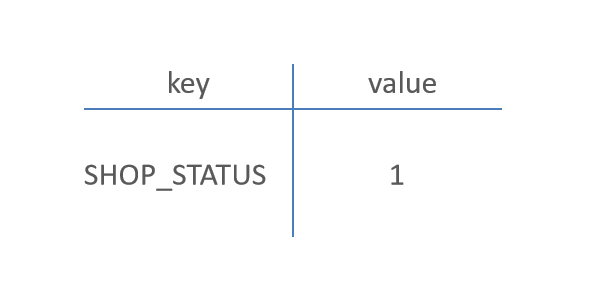 

**约定：**1表示营业 0表示打烊


### 1.2 代码开发

#### 1.2.1 设置营业状态

在sky-server模块中，创建ShopController.java

**根据接口定义创建ShopController的setStatus设置营业状态方法：**

```java
package com.sky.controller.admin;

import com.sky.result.Result;
import io.swagger.annotations.Api;
import io.swagger.annotations.ApiOperation;
import lombok.extern.slf4j.Slf4j;
import org.springframework.beans.factory.annotation.Autowired;
import org.springframework.data.redis.core.RedisTemplate;
import org.springframework.web.bind.annotation.PathVariable;
import org.springframework.web.bind.annotation.PutMapping;
import org.springframework.web.bind.annotation.RequestMapping;
import org.springframework.web.bind.annotation.RestController;

@RestController("adminShopController")
@RequestMapping("/admin/shop")
@Api(tags = "店铺相关接口")
@Slf4j
public class ShopController {

    public static final String KEY = "SHOP_STATUS";

    @Autowired
    private RedisTemplate redisTemplate;

    /**
     * 设置店铺的营业状态
     * @param status
     * @return
     */
    @PutMapping("/{status}")
    @ApiOperation("设置店铺的营业状态")
    public Result setStatus(@PathVariable Integer status){
        log.info("设置店铺的营业状态为：{}",status == 1 ? "营业中" : "打烊中");
        redisTemplate.opsForValue().set(KEY,status);
        return Result.success();
    }
}
```


#### 1.2.2 管理端查询营业状态

**根据接口定义创建ShopController的getStatus查询营业状态方法：**

```java
	/**
     * 获取店铺的营业状态
     * @return
     */
    @GetMapping("/status")
    @ApiOperation("获取店铺的营业状态")
    public Result<Integer> getStatus(){
        Integer status = (Integer) redisTemplate.opsForValue().get(KEY);
        log.info("获取到店铺的营业状态为：{}",status == 1 ? "营业中" : "打烊中");
        return Result.success(status);
    }
```


#### 1.2.3 用户端查询营业状态

创建com.sky.controller.user包，在该包下创建ShopController.java

**根据接口定义创建ShopController的getStatus查询营业状态方法：**

```java
package com.sky.controller.user;

import com.sky.result.Result;
import io.swagger.annotations.Api;
import io.swagger.annotations.ApiOperation;
import lombok.extern.slf4j.Slf4j;
import org.springframework.beans.factory.annotation.Autowired;
import org.springframework.data.redis.core.RedisTemplate;
import org.springframework.web.bind.annotation.*;

@RestController("userShopController")
@RequestMapping("/user/shop")
@Api(tags = "店铺相关接口")
@Slf4j
public class ShopController {

    public static final String KEY = "SHOP_STATUS";

    @Autowired
    private RedisTemplate redisTemplate;

    /**
     * 获取店铺的营业状态
     * @return
     */
    @GetMapping("/status")
    @ApiOperation("获取店铺的营业状态")
    public Result<Integer> getStatus(){
        Integer status = (Integer) redisTemplate.opsForValue().get(KEY);
        log.info("获取到店铺的营业状态为：{}",status == 1 ? "营业中" : "打烊中");
        return Result.success(status);
    }
}
```


### 1.3 功能测试

#### 1.3.1 接口文档测试

**启动服务：**访问http://localhost:8080/doc.html，打开店铺相关接口

**注意：**使用admin用户登录重新获取token，防止token失效。

**设置营业状态：**

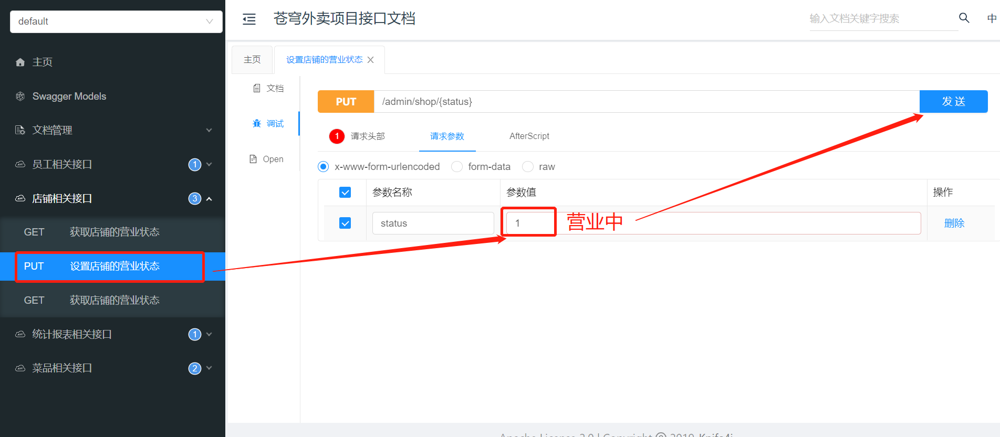 

点击发送

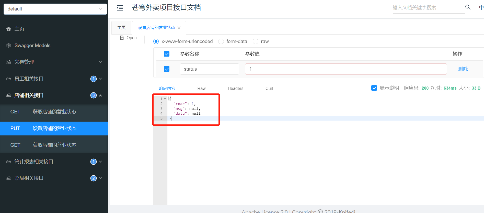 

查看Idea控制台日志

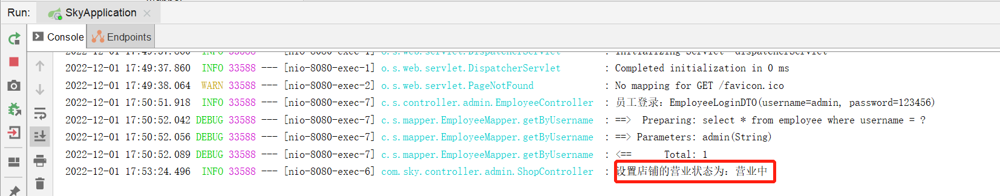 

查看Redis中数据

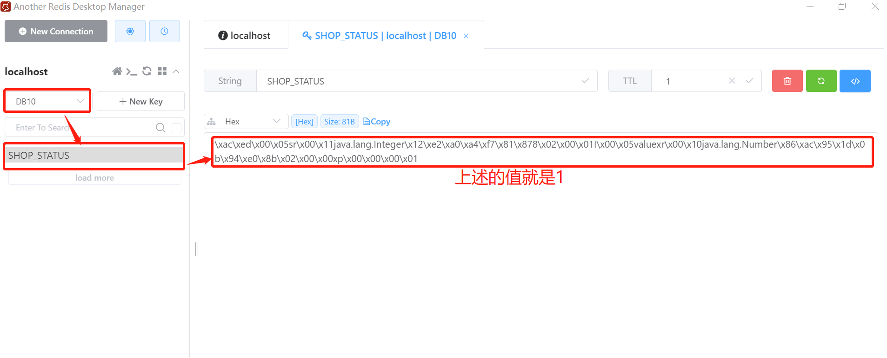 


**管理端查询营业状态：**

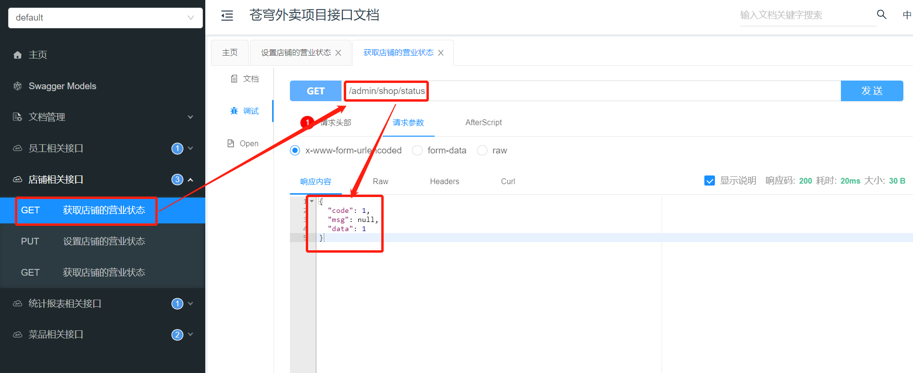 


**用户端查询营业状态：**

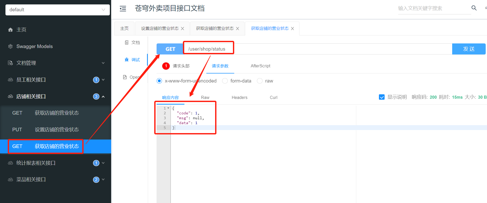 


#### 1.3.2 接口分组展示

在上述接口文档测试中，管理端和用户端的接口放在一起，不方便区分。

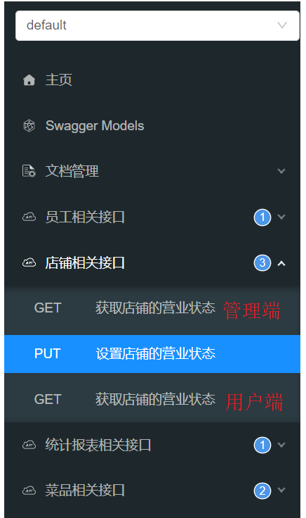 

接下来，我们要实现管理端和用户端接口进行区分。

在WebMvcConfiguration.java中，分别扫描"com.sky.controller.admin"和"com.sky.controller.user"这两个包。

```java
	@Bean
    public Docket docket1(){
        log.info("准备生成接口文档...");
        ApiInfo apiInfo = new ApiInfoBuilder()
                .title("苍穹外卖项目接口文档")
                .version("2.0")
                .description("苍穹外卖项目接口文档")
                .build();

        Docket docket = new Docket(DocumentationType.SWAGGER_2)
                .groupName("管理端接口")
                .apiInfo(apiInfo)
                .select()
                //指定生成接口需要扫描的包
                .apis(RequestHandlerSelectors.basePackage("com.sky.controller.admin"))
                .paths(PathSelectors.any())
                .build();

        return docket;
    }

    @Bean
    public Docket docket2(){
        log.info("准备生成接口文档...");
        ApiInfo apiInfo = new ApiInfoBuilder()
                .title("苍穹外卖项目接口文档")
                .version("2.0")
                .description("苍穹外卖项目接口文档")
                .build();

        Docket docket = new Docket(DocumentationType.SWAGGER_2)
                .groupName("用户端接口")
                .apiInfo(apiInfo)
                .select()
                //指定生成接口需要扫描的包
                .apis(RequestHandlerSelectors.basePackage("com.sky.controller.user"))
                .paths(PathSelectors.any())
                .build();

        return docket;
    }
```

重启服务器，再次访问接口文档，可进行选择**用户端接口**或者**管理端接口**

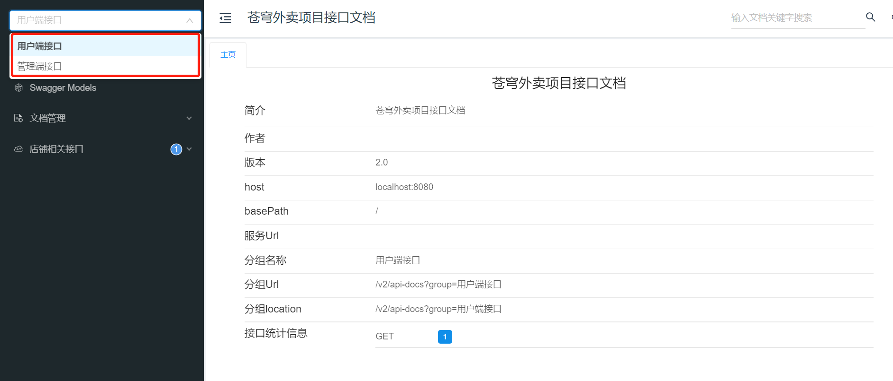 


#### 1.3.3 前后端联调测试

启动nginx,访问 http://localhost

进入后台，状态为**营业中**

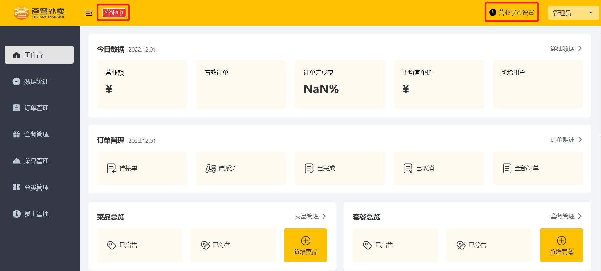 

点击**营业状态设置**，修改状态为**打烊中**

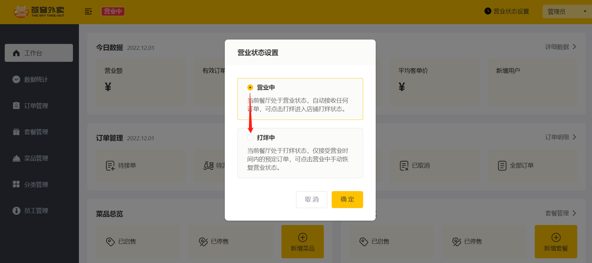 

再次查看状态，状态已为**打烊中**

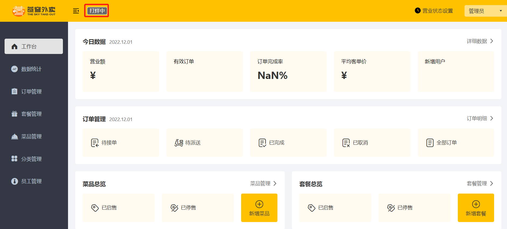 

