## 1. 来单提醒

### 1.1 需求分析和设计

用户下单并且支付成功后，需要第一时间通知外卖商家。通知的形式有如下两种：

- 语音播报  
- 弹出提示框

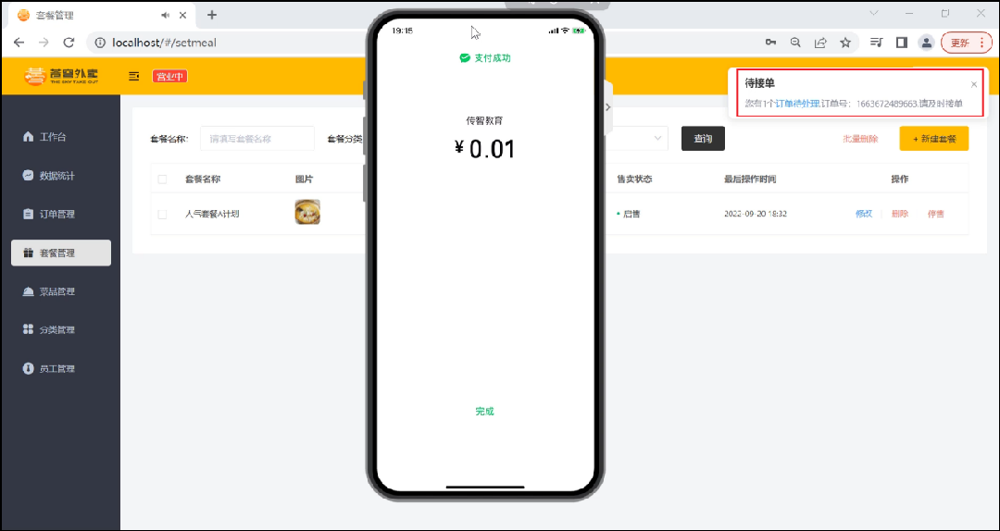 


**设计思路：**

- 通过WebSocket实现管理端页面和服务端保持长连接状态
- 当客户支付后，调用WebSocket的相关API实现服务端向客户端推送消息
- 客户端浏览器解析服务端推送的消息，判断是来单提醒还是客户催单，进行相应的消息提示和语音播报
- 约定服务端发送给客户端浏览器的数据格式为JSON，字段包括：type，orderId，content
  - type 为消息类型，1为来单提醒 2为客户催单
  - orderId 为订单id
  - content 为消息内容


导入maven坐标

```xml
<dependency>
	<groupId>org.springframework.boot</groupId>
	<artifactId>spring-boot-starter-websocket</artifactId>
</dependency>
```


导入配置类WebSocketConfiguration，注册WebSocket的服务端组件

```java
/**
 * WebSocket配置类，用于注册WebSocket的Bean
 */
@Configuration
public class WebSocketConfiguration {

    @Bean
    public ServerEndpointExporter serverEndpointExporter() {
        return new ServerEndpointExporter();
    }

}
```


### 1.2 代码开发

**在OrderServiceImpl中注入WebSocketServer对象，修改paySuccess方法，加入如下代码：**

```java
	@Autowired
    private WebSocketServer webSocketServer;
	/**
     * 支付成功，修改订单状态
     *
     * @param outTradeNo
     */
    public void paySuccess(String outTradeNo) {
        // 当前登录用户id
        Long userId = BaseContext.getCurrentId();

        // 根据订单号查询当前用户的订单
        Orders ordersDB = orderMapper.getByNumberAndUserId(outTradeNo, userId);

        // 根据订单id更新订单的状态、支付方式、支付状态、结账时间
        Orders orders = Orders.builder()
                .id(ordersDB.getId())
                .status(Orders.TO_BE_CONFIRMED)
                .payStatus(Orders.PAID)
                .checkoutTime(LocalDateTime.now())
                .build();

        orderMapper.update(orders);
		//////////////////////////////////////////////
        Map map = new HashMap();
        map.put("type", 1);//消息类型，1表示来单提醒
        map.put("orderId", orders.getId());
        map.put("content", "订单号：" + outTradeNo);

        //通过WebSocket实现来单提醒，向客户端浏览器推送消息
        webSocketServer.sendToAllClient(JSON.toJSONString(map));
        ///////////////////////////////////////////////////
    }
```


### 1.3 功能测试

可以通过如下方式进行测试：

- 查看浏览器调试工具数据交互过程
- 前后端联调

**1). 登录管理端后台**

登录成功后，浏览器与服务器建立长连接

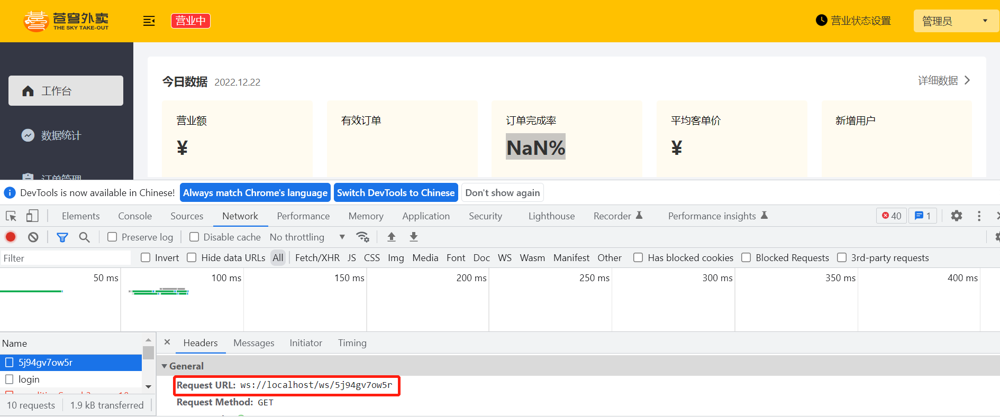 

查看控制台日志

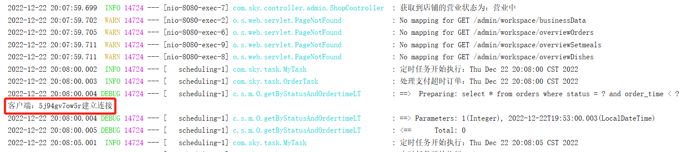 


**2). 小程序端下单支付**

修改回调地址，利用内网穿透获取域名

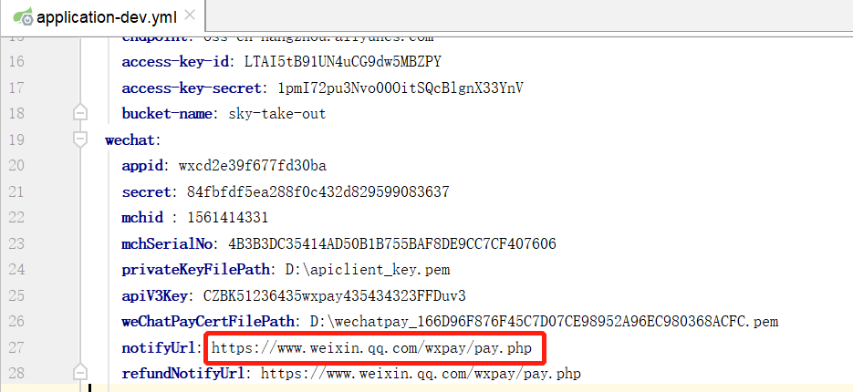 


下单支付

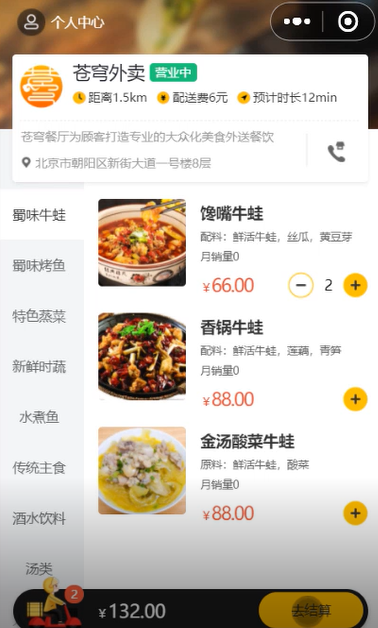 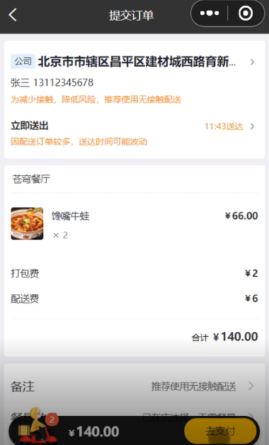 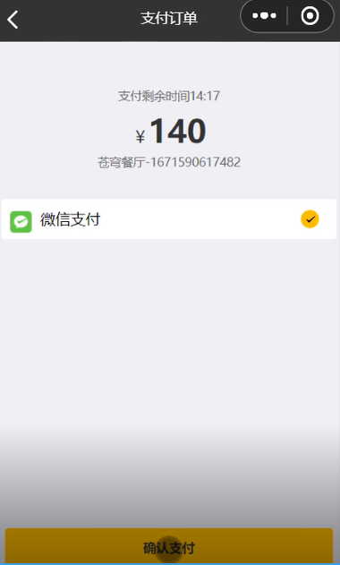 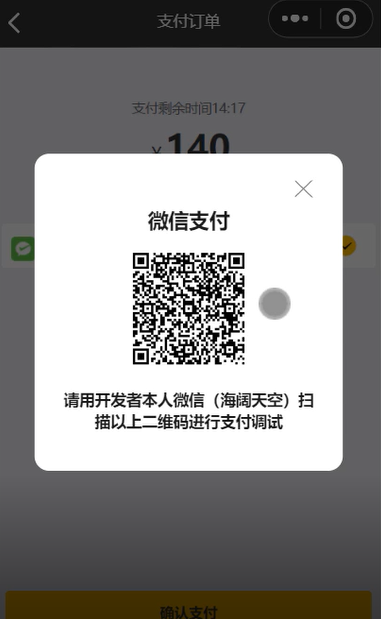


**3). 查看来单提醒**

支付成功后，后台收到来单提醒，并有语音播报

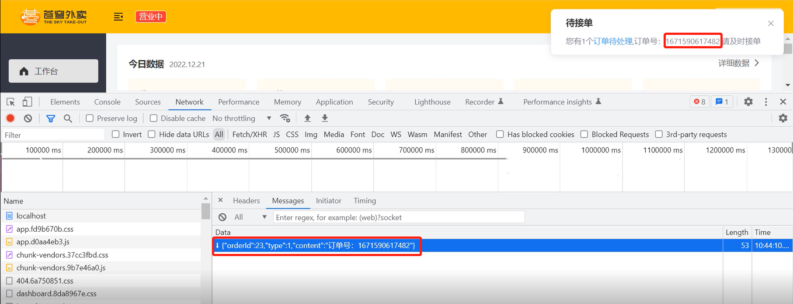 


## 2. 客户催单

### 2.1 需求分析和设计

用户在小程序中点击催单按钮后，需要第一时间通知外卖商家。通知的形式有如下两种：

- 语音播报 
- 弹出提示框

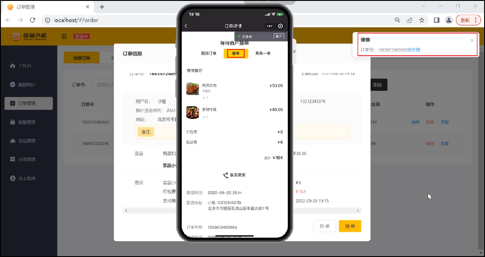 


**设计思路：**

- 通过WebSocket实现管理端页面和服务端保持长连接状态
- 当用户点击催单按钮后，调用WebSocket的相关API实现服务端向客户端推送消息
- 客户端浏览器解析服务端推送的消息，判断是来单提醒还是客户催单，进行相应的消息提示和语音播报
  约定服务端发送给客户端浏览器的数据格式为JSON，字段包括：type，orderId，content
  - type 为消息类型，1为来单提醒 2为客户催单
  - orderId 为订单id
  - content 为消息内容


当用户点击催单按钮时，向服务端发送请求。

**接口设计(催单)：**

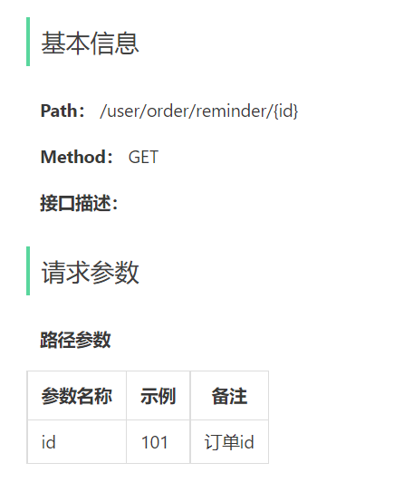 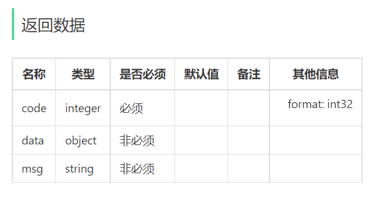


### 2.2 代码开发

#### 2.2.1 Controller层

**根据用户催单的接口定义，在user/OrderController中创建催单方法：**

```java
	/**
     * 用户催单
     *
     * @param id
     * @return
     */
    @GetMapping("/reminder/{id}")
    @ApiOperation("用户催单")
    public Result reminder(@PathVariable("id") Long id) {
        orderService.reminder(id);
        return Result.success();
    }
```


#### 2.2.2 Service层接口

**在OrderService接口中声明reminder方法：**

```java
	/**
     * 用户催单
     * @param id
     */
    void reminder(Long id);
```


#### 2.2.3 Service层实现类

**在OrderServiceImpl中实现reminder方法：**

```java
	/**
     * 用户催单
     *
     * @param id
     */
    public void reminder(Long id) {
        // 查询订单是否存在
        Orders orders = orderMapper.getById(id);
        if (orders == null) {
            throw new OrderBusinessException(MessageConstant.ORDER_NOT_FOUND);
        }

        //基于WebSocket实现催单
        Map map = new HashMap();
        map.put("type", 2);//2代表用户催单
        map.put("orderId", id);
        map.put("content", "订单号：" + orders.getNumber());
        webSocketServer.sendToAllClient(JSON.toJSONString(map));
    }
```


5.2.4 Mapper层

**在OrderMapper中添加getById：**

```java
	/**
     * 根据id查询订单
     * @param id
     */
    @Select("select * from orders where id=#{id}")
    Orders getById(Long id);
```


### 2.3 功能测试

可以通过如下方式进行测试：

- 查看浏览器调试工具数据交互过程
- 前后端联调

**1). 登录管理端后台**

登录成功后，浏览器与服务器建立长连接

 

查看控制台日志

 


**2). 用户进行催单**

用户可在订单列表或者订单详情，进行催单

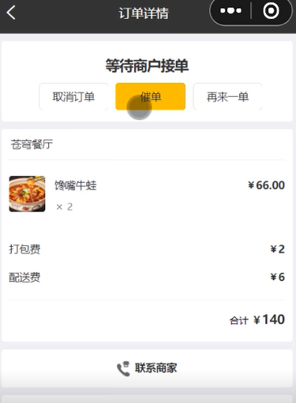 


**3). 查看催单提醒**

既有催单弹窗，同时语音播报

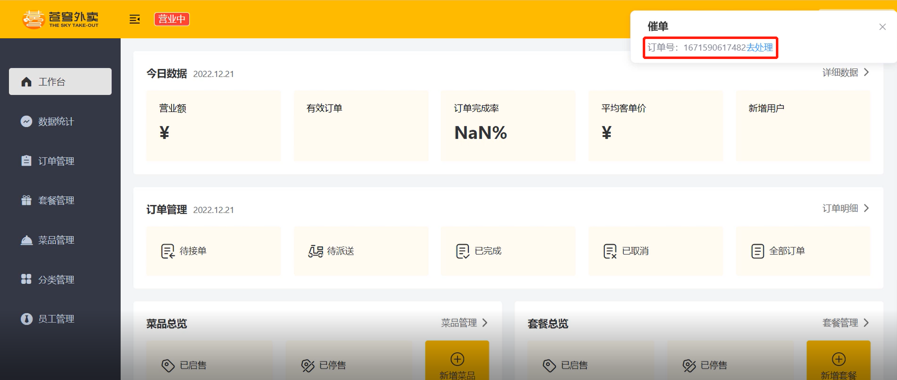 


