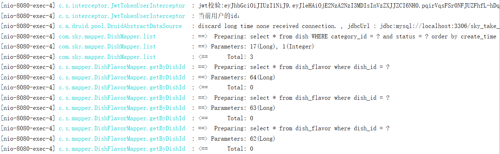

功能实现：**缓存商品**、**购物车**

**效果图：**

 


## 1. 缓存菜品

### 1.1 问题说明

用户端小程序展示的菜品数据都是通过查询数据库获得，如果用户端访问量比较大，数据库访问压力随之增大。

 

**结果：**系统响应慢、用户体验差


### 1.2 实现思路

通过Redis来缓存菜品数据，减少数据库查询操作。

 

**缓存逻辑分析：**

- 每个分类下的菜品保存一份缓存数据
- 数据库中菜品数据有变更时清理缓存数据

 


### 1.3 代码开发

**修改用户端接口 DishController 的 list 方法，加入缓存处理逻辑：**

```java
	@Autowired
    private RedisTemplate redisTemplate;
	/**
     * 根据分类id查询菜品
     *
     * @param categoryId
     * @return
     */
    @GetMapping("/list")
    @ApiOperation("根据分类id查询菜品")
    public Result<List<DishVO>> list(Long categoryId) {

        //构造redis中的key，规则：dish_分类id
        String key = "dish_" + categoryId;

        //查询redis中是否存在菜品数据
        List<DishVO> list = (List<DishVO>) redisTemplate.opsForValue().get(key);
        if(list != null && list.size() > 0){
            //如果存在，直接返回，无须查询数据库
            return Result.success(list);
        }
		////////////////////////////////////////////////////////
        Dish dish = new Dish();
        dish.setCategoryId(categoryId);
        dish.setStatus(StatusConstant.ENABLE);//查询起售中的菜品

        //如果不存在，查询数据库，将查询到的数据放入redis中
        list = dishService.listWithFlavor(dish);
        ////////////////////////////////////////////////////////
        redisTemplate.opsForValue().set(key, list);

        return Result.success(list);
    }
```

为了保证**数据库**和**Redis**中的数据保持一致，修改**管理端接口 DishController** 的相关方法，加入清理缓存逻辑。

需要改造的方法：

- 新增菜品
- 修改菜品
- 批量删除菜品
- 起售、停售菜品

**抽取清理缓存的方法：**

在管理端DishController中添加

```java
	@Autowired
    private RedisTemplate redisTemplate;
	/**
     * 清理缓存数据
     * @param pattern
     */
    private void cleanCache(String pattern){
        Set keys = redisTemplate.keys(pattern);
        redisTemplate.delete(keys);
    }
```

**调用清理缓存的方法，保证数据一致性：**

**1). 新增菜品优化**

```java
	/**
     * 新增菜品
     *
     * @param dishDTO
     * @return
     */
    @PostMapping
    @ApiOperation("新增菜品")
    public Result save(@RequestBody DishDTO dishDTO) {
        log.info("新增菜品：{}", dishDTO);
        dishService.saveWithFlavor(dishDTO);

        //清理缓存数据
        String key = "dish_" + dishDTO.getCategoryId();
        cleanCache(key);
        return Result.success();
    }
```

**2). 菜品批量删除优化**

```java
	/**
     * 菜品批量删除
     *
     * @param ids
     * @return
     */
    @DeleteMapping
    @ApiOperation("菜品批量删除")
    public Result delete(@RequestParam List<Long> ids) {
        log.info("菜品批量删除：{}", ids);
        dishService.deleteBatch(ids);

        //将所有的菜品缓存数据清理掉，所有以dish_开头的key
        cleanCache("dish_*");

        return Result.success();
    }
```

**3). 修改菜品优化**

```java
	/**
     * 修改菜品
     *
     * @param dishDTO
     * @return
     */
    @PutMapping
    @ApiOperation("修改菜品")
    public Result update(@RequestBody DishDTO dishDTO) {
        log.info("修改菜品：{}", dishDTO);
        dishService.updateWithFlavor(dishDTO);

        //将所有的菜品缓存数据清理掉，所有以dish_开头的key
        cleanCache("dish_*");

        return Result.success();
    }
```

**4). 菜品起售停售优化**

```java
	/**
     * 菜品起售停售
     *
     * @param status
     * @param id
     * @return
     */
    @PostMapping("/status/{status}")
    @ApiOperation("菜品起售停售")
    public Result<String> startOrStop(@PathVariable Integer status, Long id) {
        dishService.startOrStop(status, id);

        //将所有的菜品缓存数据清理掉，所有以dish_开头的key
        cleanCache("dish_*");

        return Result.success();
    }
```


### 1.4 功能测试

可以通过如下方式进行测试：

- 查看控制台sql
- 前后端联调
- 查看Redis中的缓存数据

以**加入缓存**、**菜品修改**两个功能测试为例，通过前后端联调方式，查看控制台sql的打印和Redis中的缓存数据变化。


**1). 加入缓存**

当第一次查询某个分类的菜品时，会从数据为中进行查询，同时将查询的结果存储到Redis中，在后绪的访问，若查询相同分类的菜品时，直接从Redis缓存中查询，不再查询数据库。

**登录小程序：**选择蜀味牛蛙(id=17)

 

**查看控制台sql：**有查询语句，说明是从数据库中进行查询

 

**查看Redis中的缓存数据：**说明缓存成功

 

**再次访问：**选择蜀味牛蛙(id=17)

 

说明是从Redis中查询的数据。


**2). 菜品修改**

当在后台修改菜品数据时，为了保证Redis缓存中的数据和数据库中的数据时刻保持一致，当修改后，需要清空对应的缓存数据。用户再次访问时，还是先从数据库中查询，同时再把查询的结果存储到Redis中，这样，就能保证缓存和数据库的数据保持一致。

**进入后台：**修改蜀味牛蛙分类下的任意一个菜品，当前分类的菜品数据已在Redis中缓存

 

**修改：**

 

**查看Redis中的缓存数据：**说明修改时，已清空缓存

 

用户再次访问同一个菜品分类时，需要先查询数据库，再把结果同步到Redis中，保证了两者数据一致性。

其它功能测试步骤基本一致，自已测试即可。


## 2. 缓存套餐

### 2.1 Spring Cache

#### 2.1.1 介绍

Spring Cache 是一个框架，实现了基于注解的缓存功能，只需要简单地加一个注解，就能实现缓存功能。

Spring Cache 提供了一层抽象，底层可以切换不同的缓存实现，例如：

- EHCache
- Caffeine
- Redis(常用)

**起步依赖：**

```xml
<dependency>
	<groupId>org.springframework.boot</groupId>
	<artifactId>spring-boot-starter-cache</artifactId>  		            		       	 		       <version>2.7.3</version> 
</dependency>
```


#### 2.1.2 常用注解

在SpringCache中提供了很多缓存操作的注解，常见的是以下的几个：

| **注解**       | **说明**                                                     |
| -------------- | ------------------------------------------------------------ |
| @EnableCaching | 开启缓存注解功能，通常加在启动类上                           |
| @Cacheable     | 在方法执行前先查询缓存中是否有数据，如果有数据，则直接返回缓存数据；如果没有缓存数据，调用方法并将方法返回值放到缓存中 |
| @CachePut      | 将方法的返回值放到缓存中                                     |
| @CacheEvict    | 将一条或多条数据从缓存中删除                                 |

在spring boot项目中，使用缓存技术只需在项目中导入相关缓存技术的依赖包，并在启动类上使用@EnableCaching开启缓存支持即可。

例如，使用Redis作为缓存技术，只需要导入Spring data Redis的maven坐标即可。


### 2.2 实现思路

**实现步骤：**

1). 导入Spring Cache和Redis相关maven坐标

2). 在启动类上加入@EnableCaching注解，开启缓存注解功能

3). 在用户端接口SetmealController的 list 方法上加入@Cacheable注解

4). 在管理端接口SetmealController的 save、delete、update、startOrStop等方法上加入CacheEvict注解


### 2.3 代码开发

按照上述实现步骤：

**1). 导入Spring Cache和Redis相关maven坐标(已实现)**

```xml
<dependency>
      <groupId>org.springframework.boot</groupId>
      <artifactId>spring-boot-starter-data-redis</artifactId>
</dependency>

<dependency>
      <groupId>org.springframework.boot</groupId>
      <artifactId>spring-boot-starter-cache</artifactId>
</dependency>
```


**2). 在启动类上加入@EnableCaching注解，开启缓存注解功能**

```java
package com.sky;

import lombok.extern.slf4j.Slf4j;
import org.springframework.boot.SpringApplication;
import org.springframework.boot.autoconfigure.SpringBootApplication;
import org.springframework.cache.annotation.EnableCaching;
import org.springframework.transaction.annotation.EnableTransactionManagement;

@SpringBootApplication
@EnableTransactionManagement //开启注解方式的事务管理
@Slf4j
@EnableCaching
public class SkyApplication {
    public static void main(String[] args) {
        SpringApplication.run(SkyApplication.class, args);
        log.info("server started");
    }
}
```


**3). 在用户端接口SetmealController的 list 方法上加入@Cacheable注解**

```java
	/**
     * 条件查询
     *
     * @param categoryId
     * @return
     */
    @GetMapping("/list")
    @ApiOperation("根据分类id查询套餐")
    @Cacheable(cacheNames = "setmealCache",key = "#categoryId") //key: setmealCache::100
    public Result<List<Setmeal>> list(Long categoryId) {
        Setmeal setmeal = new Setmeal();
        setmeal.setCategoryId(categoryId);
        setmeal.setStatus(StatusConstant.ENABLE);

        List<Setmeal> list = setmealService.list(setmeal);
        return Result.success(list);
    }
```


**4). 在管理端接口SetmealController的 save、delete、update、startOrStop等方法上加入CacheEvict注解**

```java
	/**
     * 新增套餐
     *
     * @param setmealDTO
     * @return
     */
    @PostMapping
    @ApiOperation("新增套餐")
    @CacheEvict(cacheNames = "setmealCache",key = "#setmealDTO.categoryId")//key: setmealCache::100
    public Result save(@RequestBody SetmealDTO setmealDTO) {
        setmealService.saveWithDish(setmealDTO);
        return Result.success();
    }
	/**
     * 批量删除套餐
     *
     * @param ids
     * @return
     */
    @DeleteMapping
    @ApiOperation("批量删除套餐")
    @CacheEvict(cacheNames = "setmealCache",allEntries = true)
    public Result delete(@RequestParam List<Long> ids) {
        setmealService.deleteBatch(ids);
        return Result.success();
    }
	/**
     * 修改套餐
     *
     * @param setmealDTO
     * @return
     */
    @PutMapping
    @ApiOperation("修改套餐")
    @CacheEvict(cacheNames = "setmealCache",allEntries = true)
    public Result update(@RequestBody SetmealDTO setmealDTO) {
        setmealService.update(setmealDTO);
        return Result.success();
    }

    /**
     * 套餐起售停售
     *
     * @param status
     * @param id
     * @return
     */
    @PostMapping("/status/{status}")
    @ApiOperation("套餐起售停售")
    @CacheEvict(cacheNames = "setmealCache",allEntries = true)
    public Result startOrStop(@PathVariable Integer status, Long id) {
        setmealService.startOrStop(status, id);
        return Result.success();
    }
```


### 2.4 功能测试

通过前后端联调方式来进行测试，同时观察redis中缓存的套餐数据。和**缓存菜品**功能测试基本一致，不再赘述。


