## 1. 订单支付

### 1.1 微信支付介绍

前面的课程已经实现了用户下单，那接下来就是订单支付，就是完成付款功能。支付大家应该都不陌生了，在现实生活中经常购买商品并且使用支付功能来付款，在付款的时候可能使用比较多的就是微信支付和支付宝支付了。在苍穹外卖项目中，选择的就是**微信支付**这种支付方式。

要实现微信支付就需要注册微信支付的一个商户号，这个商户号是必须要有一家企业并且有正规的营业执照。只有具备了这些资质之后，才可以去注册商户号，才能开通支付权限。

个人不具备这种资质，所以我们在学习微信支付时，最重要的是了解微信支付的流程，并且能够阅读微信官方提供的接口文档，能够和第三方支付平台对接起来就可以了。

**微信支付产品：**

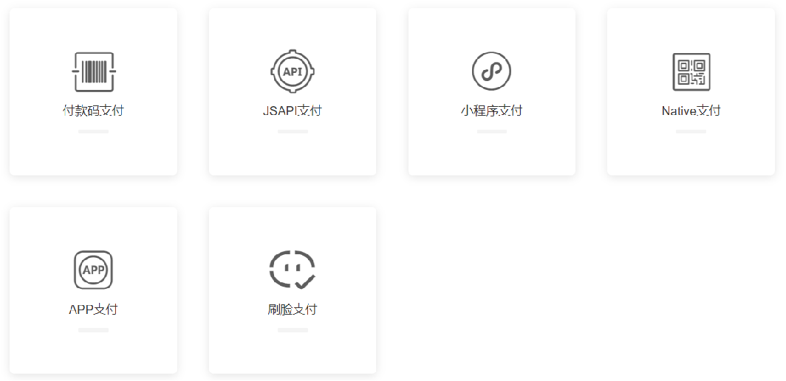 

本项目选择**小程序支付**

参考：https://pay.weixin.qq.com/static/product/product_index.shtml


**微信支付接入流程：**

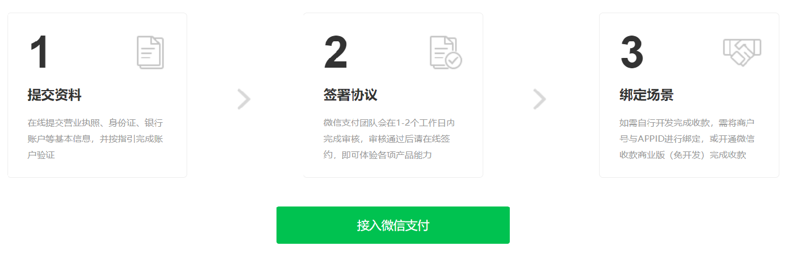 


**微信小程序支付时序图：**

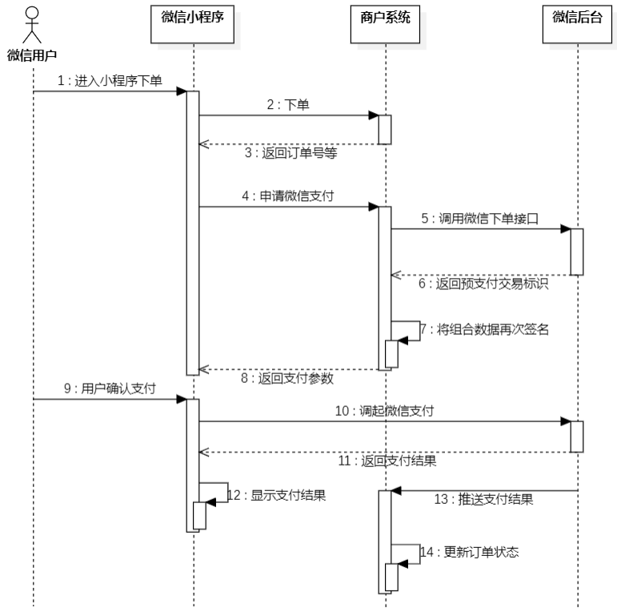 


**微信支付相关接口：**

**JSAPI下单：**商户系统调用该接口在微信支付服务后台生成预支付交易单(对应时序图的第5步)

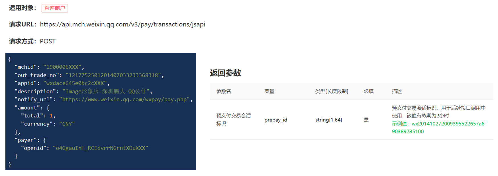


**微信小程序调起支付：**通过JSAPI下单接口获取到发起支付的必要参数prepay_id，然后使用微信支付提供的小程序方法调起小程序支付(对应时序图的第10步)

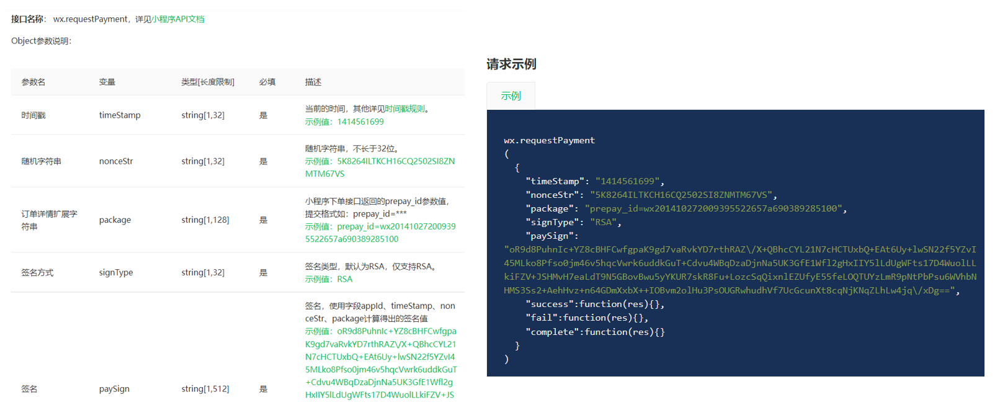 


### 1.2 微信支付准备工作

#### 1.2.1 如何保证数据安全？

完成微信支付有两个关键的步骤：

**第一个**就是需要在商户系统当中调用微信后台的一个下单接口，就是生成预支付交易单。

**第二个**就是支付成功之后微信后台会给推送消息。

这两个接口数据的安全性，要求其实是非常高的。

**解决：**微信提供的方式就是对数据进行加密、解密、签名多种方式。要完成数据加密解密，需要提前准备相应的一些文件，其实就是一些证书。

**获取微信支付平台证书、商户私钥文件：**

 

在后绪程序开发过程中，就会使用到这两个文件，需要提前把这两个文件准备好。


#### 1.2.2 如何调用到商户系统？

微信后台会调用到商户系统给推送支付的结果，在这里我们就会遇到一个问题，就是微信后台怎么就能调用到我们这个商户系统呢？因为这个调用过程，其实本质上也是一个HTTP请求。

目前，商户系统它的ip地址就是当前自己电脑的ip地址，只是一个局域网内的ip地址，微信后台无法调用到。

**解决：**内网穿透。通过**cpolar软件**可以获得一个临时域名，而这个临时域名是一个公网ip，这样，微信后台就可以请求到商户系统了。

**cpolar软件的使用：**

**1). 下载与安装**

下载地址：https://dashboard.cpolar.com/get-started

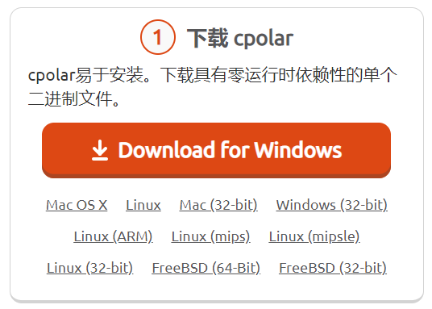 

在资料中已提供，可无需下载。

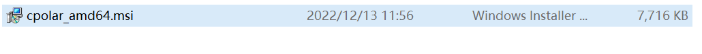 

安装过程中，一直下一步即可，不再演示。

**2). cpolar指定authtoken**

复制authtoken：

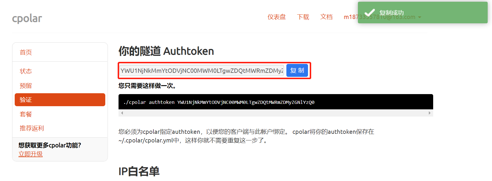 

执行命令：

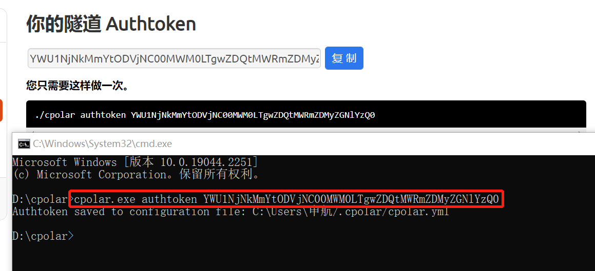 


**3). 获取临时域名**

执行命令：

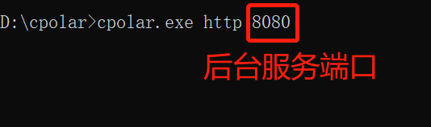 

获取域名：

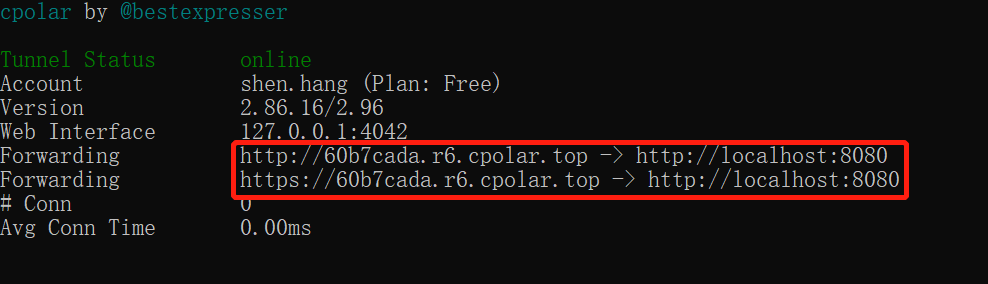 


**4). 验证临时域名有效性**

**访问接口文档**

使用localhost:8080访问

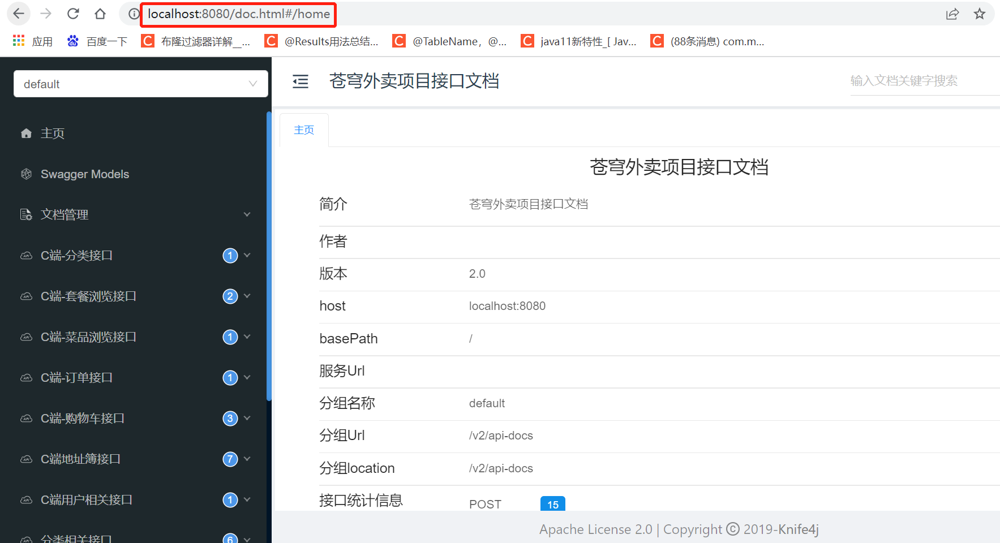 

使用临时域名访问

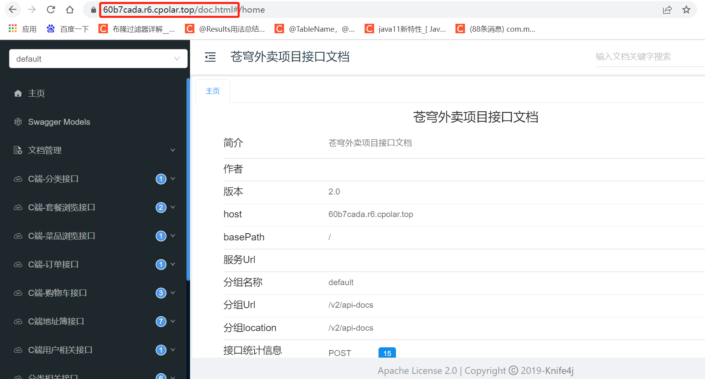 

证明临时域名生效。


### 1.3 代码导入

导入资料中的微信支付功能代码即可

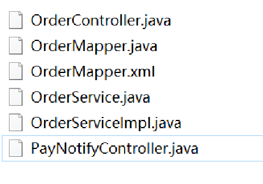 

#### 1.3.1 微信支付相关配置

application-dev.yml

```yaml
sky:
  wechat:
    appid: wxcd2e39f677fd30ba
    secret: 84fbfdf5ea288f0c432d829599083637
    mchid : 1561414331
    mchSerialNo: 4B3B3DC35414AD50B1B755BAF8DE9CC7CF407606
    privateKeyFilePath: D:\apiclient_key.pem
    apiV3Key: CZBK51236435wxpay435434323FFDuv3
    weChatPayCertFilePath: D:\wechatpay_166D96F876F45C7D07CE98952A96EC980368ACFC.pem
    notifyUrl: https://www.weixin.qq.com/wxpay/pay.php
    refundNotifyUrl: https://www.weixin.qq.com/wxpay/pay.php
```

application.yml

```yaml
sky:
  wechat:
    appid: ${sky.wechat.appid}
    secret: ${sky.wechat.secret}
    mchid : ${sky.wechat.mchid}
    mchSerialNo: ${sky.wechat.mchSerialNo}
    privateKeyFilePath: ${sky.wechat.privateKeyFilePath}
    apiV3Key: ${sky.wechat.apiV3Key}
    weChatPayCertFilePath: ${sky.wechat.weChatPayCertFilePath}
    notifyUrl: ${sky.wechat.notifyUrl}
    refundNotifyUrl: ${sky.wechat.refundNotifyUrl}

```

WeChatProperties.java：读取配置(已定义)

```java
package com.sky.properties;

import lombok.Data;
import org.springframework.beans.factory.annotation.Value;
import org.springframework.boot.context.properties.ConfigurationProperties;
import org.springframework.stereotype.Component;

@Component
@ConfigurationProperties(prefix = "sky.wechat")
@Data
public class WeChatProperties {

    private String appid; //小程序的appid
    private String secret; //小程序的秘钥
    private String mchid; //商户号
    private String mchSerialNo; //商户API证书的证书序列号
    private String privateKeyFilePath; //商户私钥文件
    private String apiV3Key; //证书解密的密钥
    private String weChatPayCertFilePath; //平台证书
    private String notifyUrl; //支付成功的回调地址
    private String refundNotifyUrl; //退款成功的回调地址
}
```


#### 1.3.2 Mapper层

**在OrderMapper.java中添加getByNumberAndUserId和update两个方法**

```java
	/**
     * 根据订单号和用户id查询订单
     * @param orderNumber
     * @param userId
     */
    @Select("select * from orders where number = #{orderNumber} and user_id= #{userId}")
    Orders getByNumberAndUserId(String orderNumber, Long userId);

    /**
     * 修改订单信息
     * @param orders
     */
    void update(Orders orders);
```

**在OrderMapper.xml中添加**

```xml
<update id="update" parameterType="com.sky.entity.Orders">
        update orders
        <set>
            <if test="cancelReason != null and cancelReason!='' ">
                cancel_reason=#{cancelReason},
            </if>
            <if test="rejectionReason != null and rejectionReason!='' ">
                rejection_reason=#{rejectionReason},
            </if>
            <if test="cancelTime != null">
                cancel_time=#{cancelTime},
            </if>
            <if test="payStatus != null">
                pay_status=#{payStatus},
            </if>
            <if test="payMethod != null">
                pay_method=#{payMethod},
            </if>
            <if test="checkoutTime != null">
                checkout_time=#{checkoutTime},
            </if>
            <if test="status != null">
                status = #{status},
            </if>
            <if test="deliveryTime != null">
                delivery_time = #{deliveryTime}
            </if>
        </set>
        where id = #{id}
</update>
```


#### 1.3.3 Service层

**在OrderService.java中添加payment和paySuccess两个方法定义**

```java
	/**
     * 订单支付
     * @param ordersPaymentDTO
     * @return
     */
    OrderPaymentVO payment(OrdersPaymentDTO ordersPaymentDTO) throws Exception;

    /**
     * 支付成功，修改订单状态
     * @param outTradeNo
     */
    void paySuccess(String outTradeNo);
```

**在OrderServiceImpl.java中实现payment和paySuccess两个方法**

```java
 	@Autowired
    private UserMapper userMapper;
	@Autowired
    private WeChatPayUtil weChatPayUtil;
    /**
     * 订单支付
     *
     * @param ordersPaymentDTO
     * @return
     */
    public OrderPaymentVO payment(OrdersPaymentDTO ordersPaymentDTO) throws Exception {
        // 当前登录用户id
        Long userId = BaseContext.getCurrentId();
        User user = userMapper.getById(userId);

        //调用微信支付接口，生成预支付交易单
        JSONObject jsonObject = weChatPayUtil.pay(
                ordersPaymentDTO.getOrderNumber(), //商户订单号
                new BigDecimal(0.01), //支付金额，单位 元
                "苍穹外卖订单", //商品描述
                user.getOpenid() //微信用户的openid
        );

        if (jsonObject.getString("code") != null && jsonObject.getString("code").equals("ORDERPAID")) {
            throw new OrderBusinessException("该订单已支付");
        }

        OrderPaymentVO vo = jsonObject.toJavaObject(OrderPaymentVO.class);
        vo.setPackageStr(jsonObject.getString("package"));

        return vo;
    }

    /**
     * 支付成功，修改订单状态
     *
     * @param outTradeNo
     */
    public void paySuccess(String outTradeNo) {
        // 当前登录用户id
        Long userId = BaseContext.getCurrentId();

        // 根据订单号查询当前用户的订单
        Orders ordersDB = orderMapper.getByNumberAndUserId(outTradeNo, userId);

        // 根据订单id更新订单的状态、支付方式、支付状态、结账时间
        Orders orders = Orders.builder()
                .id(ordersDB.getId())
                .status(Orders.TO_BE_CONFIRMED)
                .payStatus(Orders.PAID)
                .checkoutTime(LocalDateTime.now())
                .build();

        orderMapper.update(orders);
    }
```


#### 1.3.4 Controller层

**在OrderController.java中添加payment方法**

```java
 	/**
     * 订单支付
     *
     * @param ordersPaymentDTO
     * @return
     */
    @PutMapping("/payment")
    @ApiOperation("订单支付")
    public Result<OrderPaymentVO> payment(@RequestBody OrdersPaymentDTO ordersPaymentDTO) throws Exception {
        log.info("订单支付：{}", ordersPaymentDTO);
        OrderPaymentVO orderPaymentVO = orderService.payment(ordersPaymentDTO);
        log.info("生成预支付交易单：{}", orderPaymentVO);
        return Result.success(orderPaymentVO);
    }
```

PayNotifyController.java

```java
package com.sky.controller.notify;

import com.alibaba.druid.support.json.JSONUtils;
import com.alibaba.fastjson.JSON;
import com.alibaba.fastjson.JSONObject;
import com.sky.annotation.IgnoreToken;
import com.sky.properties.WeChatProperties;
import com.sky.service.OrderService;
import com.wechat.pay.contrib.apache.httpclient.util.AesUtil;
import lombok.extern.slf4j.Slf4j;
import org.apache.http.entity.ContentType;
import org.springframework.beans.factory.annotation.Autowired;
import org.springframework.web.bind.annotation.RequestMapping;
import org.springframework.web.bind.annotation.RestController;
import javax.servlet.http.HttpServletRequest;
import javax.servlet.http.HttpServletResponse;
import java.io.BufferedReader;
import java.nio.charset.StandardCharsets;
import java.util.HashMap;

/**
 * 支付回调相关接口
 */
@RestController
@RequestMapping("/notify")
@Slf4j
public class PayNotifyController {
    @Autowired
    private OrderService orderService;
    @Autowired
    private WeChatProperties weChatProperties;

    /**
     * 支付成功回调
     *
     * @param request
     */
    @RequestMapping("/paySuccess")
    public void paySuccessNotify(HttpServletRequest request, HttpServletResponse response) throws Exception {
        //读取数据
        String body = readData(request);
        log.info("支付成功回调：{}", body);

        //数据解密
        String plainText = decryptData(body);
        log.info("解密后的文本：{}", plainText);

        JSONObject jsonObject = JSON.parseObject(plainText);
        String outTradeNo = jsonObject.getString("out_trade_no");//商户平台订单号
        String transactionId = jsonObject.getString("transaction_id");//微信支付交易号

        log.info("商户平台订单号：{}", outTradeNo);
        log.info("微信支付交易号：{}", transactionId);

        //业务处理，修改订单状态、来单提醒
        orderService.paySuccess(outTradeNo);

        //给微信响应
        responseToWeixin(response);
    }

    /**
     * 读取数据
     *
     * @param request
     * @return
     * @throws Exception
     */
    private String readData(HttpServletRequest request) throws Exception {
        BufferedReader reader = request.getReader();
        StringBuilder result = new StringBuilder();
        String line = null;
        while ((line = reader.readLine()) != null) {
            if (result.length() > 0) {
                result.append("\n");
            }
            result.append(line);
        }
        return result.toString();
    }

    /**
     * 数据解密
     *
     * @param body
     * @return
     * @throws Exception
     */
    private String decryptData(String body) throws Exception {
        JSONObject resultObject = JSON.parseObject(body);
        JSONObject resource = resultObject.getJSONObject("resource");
        String ciphertext = resource.getString("ciphertext");
        String nonce = resource.getString("nonce");
        String associatedData = resource.getString("associated_data");

        AesUtil aesUtil = new AesUtil(weChatProperties.getApiV3Key().getBytes(StandardCharsets.UTF_8));
        //密文解密
        String plainText = aesUtil.decryptToString(associatedData.getBytes(StandardCharsets.UTF_8),
                nonce.getBytes(StandardCharsets.UTF_8),
                ciphertext);

        return plainText;
    }

    /**
     * 给微信响应
     * @param response
     */
    private void responseToWeixin(HttpServletResponse response) throws Exception{
        response.setStatus(200);
        HashMap<Object, Object> map = new HashMap<>();
        map.put("code", "SUCCESS");
        map.put("message", "SUCCESS");
        response.setHeader("Content-type", ContentType.APPLICATION_JSON.toString());
        response.getOutputStream().write(JSONUtils.toJSONString(map).getBytes(StandardCharsets.UTF_8));
        response.flushBuffer();
    }
}
```


### 1.4 功能测试

测试过程中，可通过断点方式查看后台每一步执行情况。

**下单：**

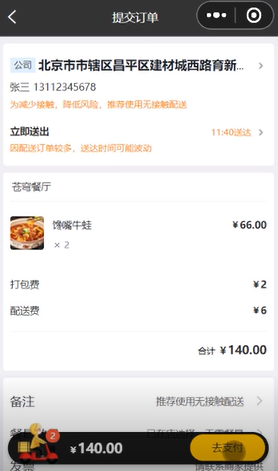 

**去支付：**

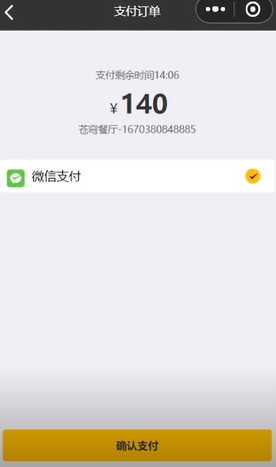 

**确认支付：**

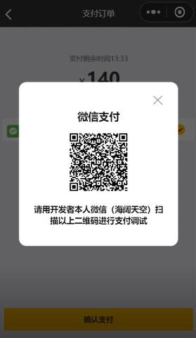 

进行扫码支付即可。

