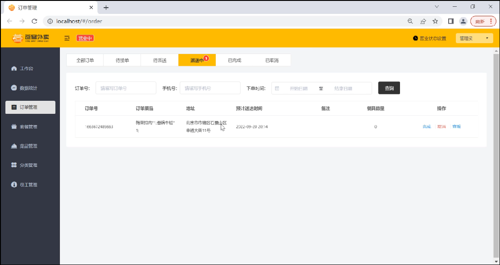
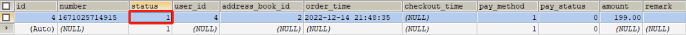
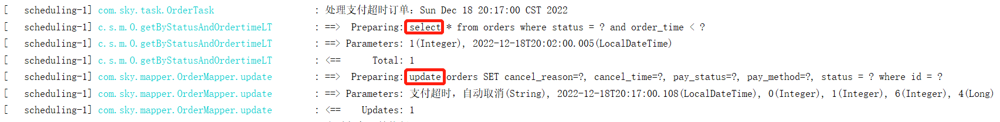
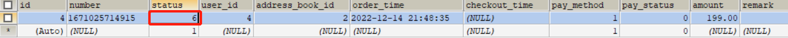

## 1.订单状态定时处理

### 1.1 需求分析

用户下单后可能存在的情况：

- 下单后未支付，订单一直处于**“待支付”**状态
- 用户收货后管理端未点击完成按钮，订单一直处于**“派送中”**状态

                  

支付超时的订单如何处理？                                                       派送中的订单一直不点击完成如何处理？


对于上面两种情况需要通过**定时任务**来修改订单状态，具体逻辑为：

- 通过定时任务每分钟检查一次是否存在支付超时订单（下单后超过15分钟仍未支付则判定为支付超时订单），如果存在则修改订单状态为“已取消”
- 通过定时任务每天凌晨1点检查一次是否存在“派送中”的订单，如果存在则修改订单状态为“已完成”


### 1.2 代码开发

**1). 自定义定时任务类OrderTask（待完善）：**

```java
package com.sky.task;

/**
 * 自定义定时任务，实现订单状态定时处理
 */
@Component
@Slf4j
public class OrderTask {

    @Autowired
    private OrderMapper orderMapper;

    /**
     * 处理支付超时订单
     */
    @Scheduled(cron = "0 * * * * ?")
    public void processTimeoutOrder(){
        log.info("处理支付超时订单：{}", new Date());
    }

    /**
     * 处理“派送中”状态的订单
     */
    @Scheduled(cron = "0 0 1 * * ?")
    public void processDeliveryOrder(){
        log.info("处理派送中订单：{}", new Date());
    }

}
```


**2). 在OrderMapper接口中扩展方法:**

```java
	/**
     * 根据状态和下单时间查询订单
     * @param status
     * @param orderTime
     */
    @Select("select * from orders where status = #{status} and order_time < #{orderTime}")
    List<Orders> getByStatusAndOrdertimeLT(Integer status, LocalDateTime orderTime);
```


**3). 完善定时任务类的processTimeoutOrder方法：**

```java
	/**
     * 处理支付超时订单
     */
    @Scheduled(cron = "0 * * * * ?")
    public void processTimeoutOrder(){
        log.info("处理支付超时订单：{}", new Date());

        LocalDateTime time = LocalDateTime.now().plusMinutes(-15);

        // select * from orders where status = 1 and order_time < 当前时间-15分钟
        List<Orders> ordersList = orderMapper.getByStatusAndOrdertimeLT(Orders.PENDING_PAYMENT, time);
        if(ordersList != null && ordersList.size() > 0){
            ordersList.forEach(order -> {
                order.setStatus(Orders.CANCELLED);
                order.setCancelReason("支付超时，自动取消");
                order.setCancelTime(LocalDateTime.now());
                orderMapper.update(order);
            });
        }
    }
```


**4). 完善定时任务类的processDeliveryOrder方法：**

```java
	/**
     * 处理“派送中”状态的订单
     */
    @Scheduled(cron = "0 0 1 * * ?")
    public void processDeliveryOrder(){
        log.info("处理派送中订单：{}", new Date());
        // select * from orders where status = 4 and order_time < 当前时间-1小时
        LocalDateTime time = LocalDateTime.now().plusMinutes(-60);
        List<Orders> ordersList = orderMapper.getByStatusAndOrdertimeLT(Orders.DELIVERY_IN_PROGRESS, time);

        if(ordersList != null && ordersList.size() > 0){
            ordersList.forEach(order -> {
                order.setStatus(Orders.COMPLETED);
                orderMapper.update(order);
            });
        }
    }
```


### 1.3 功能测试

可以通过如下方式进行测试：

- 查看控制台sql
- 查看数据库中数据变化


**支付超时的订单测试：**

**1). 查看订单表**

有一条订单，状态为1。订单状态 1待付款 2待接单 3已接单 4派送中 5已完成 6已取消

 


**2). 开启定时任务**

启动服务，观察控制台日志。处理支付超时订单任务每隔1分钟执行一次。

 


**3). 再次查看订单表**

状态已更改为6，已取消。

 

证明定时任务已生效。

**处理“派送中”状态的订单任务**测试自已完成，测试步骤和上述一致。可适当修改cron表达式，改变任务执行频率，方便测试。