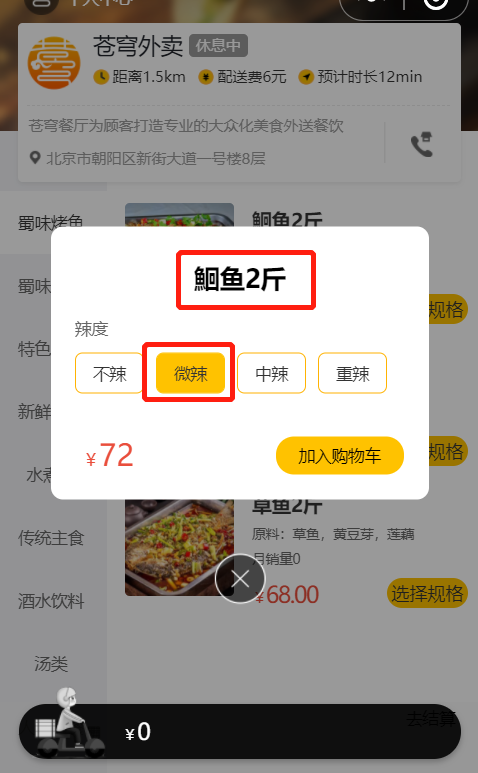
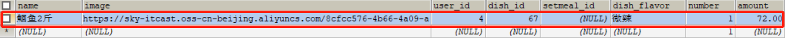
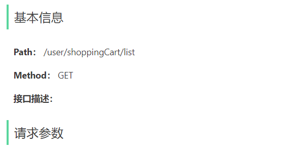
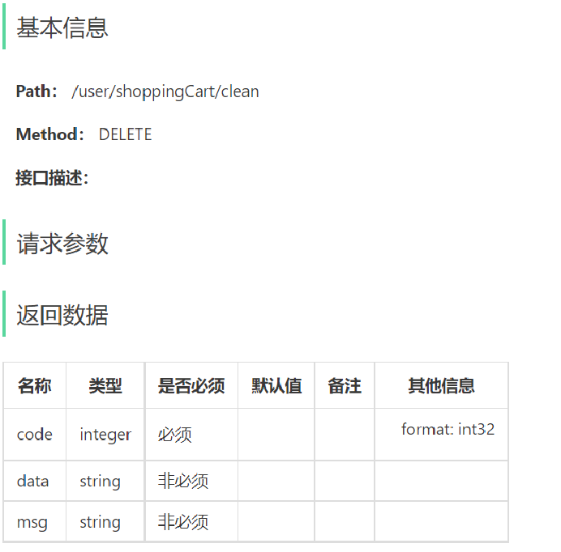
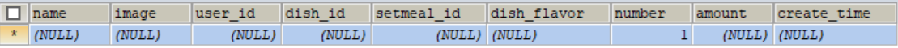

## 1. 添加购物车

### 1.1 需求分析和设计

#### 1.1.1 产品原型

用户可以将菜品或者套餐添加到购物车。对于菜品来说，如果设置了口味信息，则需要选择规格后才能加入购物车;对于套餐来说，可以直接点击将当前套餐加入购物车。在购物车中可以修改菜品和套餐的数量，也可以清空购物车。

**效果图：**

  


#### 1.1.2 接口设计

通过上述原型图，设计出对应的添加购物车接口。

 

**说明：**添加购物车时，有可能添加菜品，也有可能添加套餐。故传入参数要么是菜品id，要么是套餐id。


#### 1.1.3 表设计

用户的购物车数据，也是需要保存在数据库中的，购物车对应的数据表为shopping_cart表，具体表结构如下：

| **字段名**  | **数据类型**  | **说明**     | **备注** |
| ----------- | ------------- | ------------ | -------- |
| id          | bigint        | 主键         | 自增     |
| name        | varchar(32)   | 商品名称     | 冗余字段 |
| image       | varchar(255)  | 商品图片路径 | 冗余字段 |
| user_id     | bigint        | 用户id       | 逻辑外键 |
| dish_id     | bigint        | 菜品id       | 逻辑外键 |
| setmeal_id  | bigint        | 套餐id       | 逻辑外键 |
| dish_flavor | varchar(50)   | 菜品口味     |          |
| number      | int           | 商品数量     |          |
| amount      | decimal(10,2) | 商品单价     | 冗余字段 |
| create_time | datetime      | 创建时间     |          |

**说明：** 

- 购物车数据是关联用户的，在表结构中，我们需要记录，每一个用户的购物车数据是哪些
- 菜品列表展示出来的既有套餐，又有菜品，如果用户选择的是套餐，就保存套餐ID(setmeal_id)，如果用户选择的是菜品，就保存菜品ID(dish_id)
- 对同一个菜品/套餐，如果选择多份不需要添加多条记录，增加数量number即可


### 1.2 代码开发

#### 1.2.1 DTO设计

**根据添加购物车接口的参数设计DTO：**

 

在sky-pojo模块，ShoppingCartDTO.java已定义

```java
package com.sky.dto;

import lombok.Data;
import java.io.Serializable;

@Data
public class ShoppingCartDTO implements Serializable {

    private Long dishId;
    private Long setmealId;
    private String dishFlavor;

}
```


#### 1.2.2 Controller层

**根据添加购物车接口创建ShoppingCartController：**

```java
package com.sky.controller.user;


import com.sky.dto.ShoppingCartDTO;
import com.sky.result.Result;
import io.swagger.annotations.Api;
import io.swagger.annotations.ApiOperation;
import lombok.extern.slf4j.Slf4j;
import org.springframework.beans.factory.annotation.Autowired;
import org.springframework.web.bind.annotation.PostMapping;
import org.springframework.web.bind.annotation.RequestBody;
import org.springframework.web.bind.annotation.RequestMapping;
import org.springframework.web.bind.annotation.RestController;

/**
 * 购物车
 */
@RestController
@RequestMapping("/user/shoppingCart")
@Slf4j
@Api(tags = "C端-购物车接口")
public class ShoppingCartController {

    @Autowired
    private ShoppingCartService shoppingCartService;

    /**
     * 添加购物车
     * @param shoppingCartDTO
     * @return
     */
    @PostMapping("/add")
    @ApiOperation("添加购物车")
    public Result<String> add(@RequestBody ShoppingCartDTO shoppingCartDTO){
        log.info("添加购物车：{}", shoppingCartDTO);
        shoppingCartService.addShoppingCart(shoppingCartDTO);//后绪步骤实现
        return Result.success();
    }
}
```


#### 1.2.3 Service层接口

**创建ShoppingCartService接口：**

```java
package com.sky.service;

import com.sky.dto.ShoppingCartDTO;
import com.sky.entity.ShoppingCart;
import java.util.List;

public interface ShoppingCartService {

    /**
     * 添加购物车
     * @param shoppingCartDTO
     */
    void addShoppingCart(ShoppingCartDTO shoppingCartDTO);
}
```


#### 1.2.4 Service层实现类

**创建ShoppingCartServiceImpl实现类，并实现add方法：**

```java
package com.sky.service.impl;


import com.sky.context.BaseContext;
import com.sky.dto.ShoppingCartDTO;
import com.sky.entity.Dish;
import com.sky.entity.Setmeal;
import com.sky.entity.ShoppingCart;
import com.sky.mapper.DishMapper;
import com.sky.mapper.SetmealMapper;
import com.sky.service.ShoppingCartService;
import org.springframework.beans.BeanUtils;
import org.springframework.beans.factory.annotation.Autowired;
import org.springframework.stereotype.Service;
import java.time.LocalDateTime;
import java.util.List;

@Service
public class ShoppingCartServiceImpl implements ShoppingCartService {

    @Autowired
    private ShoppingCartMapper shoppingCartMapper;
    @Autowired
    private DishMapper dishMapper;
    @Autowired
    private SetmealMapper setmealMapper;
    
    /**
     * 添加购物车
     *
     * @param shoppingCartDTO
     */
    public void addShoppingCart(ShoppingCartDTO shoppingCartDTO) {
        ShoppingCart shoppingCart = new ShoppingCart();
        BeanUtils.copyProperties(shoppingCartDTO, shoppingCart);
        //只能查询自己的购物车数据
        shoppingCart.setUserId(BaseContext.getCurrentId());

        //判断当前商品是否在购物车中
        List<ShoppingCart> shoppingCartList = shoppingCartMapper.list(shoppingCart);

        if (shoppingCartList != null && shoppingCartList.size() == 1) {
            //如果已经存在，就更新数量，数量加1
            shoppingCart = shoppingCartList.get(0);
            shoppingCart.setNumber(shoppingCart.getNumber() + 1);
            shoppingCartMapper.updateNumberById(shoppingCart);
        } else {
            //如果不存在，插入数据，数量就是1

            //判断当前添加到购物车的是菜品还是套餐
            Long dishId = shoppingCartDTO.getDishId();
            if (dishId != null) {
                //添加到购物车的是菜品
                Dish dish = dishMapper.getById(dishId);
                shoppingCart.setName(dish.getName());
                shoppingCart.setImage(dish.getImage());
                shoppingCart.setAmount(dish.getPrice());
            } else {
                //添加到购物车的是套餐
                Setmeal setmeal = setmealMapper.getById(shoppingCartDTO.getSetmealId());
                shoppingCart.setName(setmeal.getName());
                shoppingCart.setImage(setmeal.getImage());
                shoppingCart.setAmount(setmeal.getPrice());
            }
            shoppingCart.setNumber(1);
            shoppingCart.setCreateTime(LocalDateTime.now());
            shoppingCartMapper.insert(shoppingCart);
        }
    }
}
```


#### 1.2.5 Mapper层

**创建ShoppingCartMapper接口:**

```java
package com.sky.mapper;

import com.sky.entity.ShoppingCart;
import org.apache.ibatis.annotations.Delete;
import org.apache.ibatis.annotations.Insert;
import org.apache.ibatis.annotations.Mapper;
import org.apache.ibatis.annotations.Update;
import java.util.List;

@Mapper
public interface ShoppingCartMapper {
    /**
     * 条件查询
     *
     * @param shoppingCart
     * @return
     */
    List<ShoppingCart> list(ShoppingCart shoppingCart);

    /**
     * 更新商品数量
     *
     * @param shoppingCart
     */
    @Update("update shopping_cart set number = #{number} where id = #{id}")
    void updateNumberById(ShoppingCart shoppingCart);

    /**
     * 插入购物车数据
     *
     * @param shoppingCart
     */
    @Insert("insert into shopping_cart (name, user_id, dish_id, setmeal_id, dish_flavor, number, amount, image, create_time) " +
            " values (#{name},#{userId},#{dishId},#{setmealId},#{dishFlavor},#{number},#{amount},#{image},#{createTime})")
    void insert(ShoppingCart shoppingCart);

}
```

**创建ShoppingCartMapper.xml：**

```xml
<?xml version="1.0" encoding="UTF-8" ?>
<!DOCTYPE mapper PUBLIC "-//mybatis.org//DTD Mapper 3.0//EN" "http://mybatis.org/dtd/mybatis-3-mapper.dtd" >
<mapper namespace="com.sky.mapper.ShoppingCartMapper">
    <select id="list" parameterType="ShoppingCart" resultType="ShoppingCart">
        select * from shopping_cart
        <where>
            <if test="userId != null">
                and user_id = #{userId}
            </if>
            <if test="dishId != null">
                and dish_id = #{dishId}
            </if>
            <if test="setmealId != null">
                and setmeal_id = #{setmealId}
            </if>
            <if test="dishFlavor != null">
                and dish_flavor = #{dishFlavor}
            </if>
        </where>
        order by create_time desc
    </select>
</mapper>
```


### 1.3 功能测试

进入小程序，添加菜品

 

加入购物车，查询数据库

 

因为现在没有实现查看购物车功能，所以只能在表中进行查看。

在前后联调时，后台可通断点方式启动，查看运行的每一步。


## 2. 查看购物车

### 2.1 需求分析和设计

#### 2.1.1 产品原型

当用户添加完菜品和套餐后，可进入到购物车中，查看购物中的菜品和套餐。

 


#### 2.1.2 接口设计

 


### 2.2 代码开发

#### 2.2.1 Controller层

**在ShoppingCartController中创建查看购物车的方法：**

```java
	/**
     * 查看购物车
     * @return
     */
    @GetMapping("/list")
    @ApiOperation("查看购物车")
    public Result<List<ShoppingCart>> list(){
        return Result.success(shoppingCartService.showShoppingCart());
    }
```


#### 2.2.2 Service层接口

**在ShoppingCartService接口中声明查看购物车的方法：**

```java
	/**
     * 查看购物车
     * @return
     */
    List<ShoppingCart> showShoppingCart();
```


#### 2.2.3 Service层实现类

**在ShoppingCartServiceImpl中实现查看购物车的方法：**

```java
	/**
     * 查看购物车
     * @return
     */
    public List<ShoppingCart> showShoppingCart() {
        return shoppingCartMapper.list(ShoppingCart.
                                       builder().
                                       userId(BaseContext.getCurrentId()).
                                       build());
    }
```


### 2.3 功能测试

当进入小程序时，就会发起查看购物车的请求

 

点击购物车图标

 

测试成功。


## 3. 清空购物车

### 3.1 需求分析和设计

#### 3.1.1 产品原型

当点击清空按钮时，会把购物车中的数据全部清空。

 


#### 3.1.2 接口设计

 


### 3.2 代码开发

#### 3.2.1 Controller层

**在ShoppingCartController中创建清空购物车的方法：**

```java
	/**
     * 清空购物车商品
     * @return
     */
    @DeleteMapping("/clean")
    @ApiOperation("清空购物车商品")
    public Result<String> clean(){
        shoppingCartService.cleanShoppingCart();
        return Result.success();
    }
```


#### 3.2.2 Service层接口

**在ShoppingCartService接口中声明清空购物车的方法：**

```java
	/**
     * 清空购物车商品
     */
    void cleanShoppingCart();
```


#### 3.2.3 Service层实现类

**在ShoppingCartServiceImpl中实现清空购物车的方法：**

```java
	/**
     * 清空购物车商品
     */
    public void cleanShoppingCart() {
        shoppingCartMapper.deleteByUserId(BaseContext.getCurrentId());
    }
```


#### 3.2.4 Mapper层

**在ShoppingCartMapper接口中创建删除购物车数据的方法：**

```java
	/**
     * 根据用户id删除购物车数据
     *
     * @param userId
     */
    @Delete("delete from shopping_cart where user_id = #{userId}")
    void deleteByUserId(Long userId);
```


### 3.3 功能测试

进入到购物车页面

 

点击清空

 

查看数据库中的数据

 

说明当前用户的购物车数据已全部删除。
